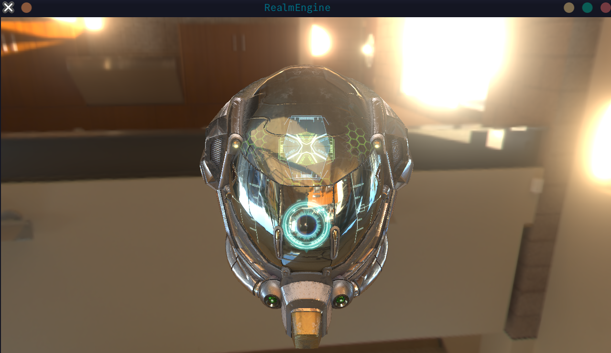

# RealmEngine

一个基于 OpenGL 的现代游戏引擎，专注于基于物理的渲染（PBR）和高质量图形效果，支持IBL与Bloom后处理。



## 特性

- **基于物理的渲染（PBR）** - 支持金属度/粗糙度工作流
- **基于图像的照明（IBL）** - 支持 HDR 环境贴图和预计算光照
- **Bloom 后处理** - 可配置的光晕效果
- **资源管理** - 支持 glTF、FBX 等模型格式
- **窗口管理** - 基于 GLFW 的跨平台窗口系统
- **日志系统** - 基于 spdlog 的日志记录
- **场景管理** - 灵活的场景和实体系统

## 系统要求

- **操作系统**: Linux / macOS / Windows
- **编译器**: 支持 C++17 的编译器（GCC 7+, Clang 5+, MSVC 2017+）
- **CMake**: 3.20 或更高版本
- **OpenGL**: 3.3 或更高版本
- **Python**: 3.6+（手动构建也行，不推荐）

## 依赖库

项目已包含以下依赖库（位于 `libs/` 目录）：

- **GLFW** - 窗口和输入管理
- **GLAD** - OpenGL 加载器
- **GLM** - 数学库
- **Assimp** - 模型加载
- **spdlog** - 日志系统
- **ImGui** - 即时模式 GUI
- **stb** - 图像加载

项目中依赖库大部分使用submodule管理，克隆时请同时克隆依赖库，例如：

```bash
# 1.使用递归克隆
git clone --recursive https://github.com/Furry-Monster/Realm

# 2.手动管理依赖库
# 克隆原始仓库
git clone https://github.com/Furry-Monster/Realm

# 初始化子模块
git submodule init

# 下载依赖库
git submodule update
```

## 快速开始

### 使用构建脚本（推荐）

最简单的方式是使用提供的 Python 构建脚本：

```bash
# 默认构建（Debug 模式）
python build.py

# Release 模式构建
python build.py --type Release

# 构建并运行
python build.py --run

# 清理并重新构建
python build.py --clean --run
```

### 手动构建

```bash
# 创建构建目录
mkdir build && cd build

# 配置 CMake
cmake .. -DCMAKE_BUILD_TYPE=Debug

# 编译
cmake --build . -j$(nproc)

# 运行（Linux/macOS）
../bin/RealmEngine

# 运行（Windows）
..\bin\RealmEngine.exe
```

## 项目结构

```
RealmEngine/
├── assets/          # 资源文件（模型、纹理、HDR 等，这里的文件会自动打包成导出资源）
├── shaders/         # GLSL 着色器文件（通上，也会打包成导出资源）
├── src/             # 源代码
│   ├── main.cpp     # 引擎主循环
│   ├── render/      # 渲染系统
│   ├── resource/    # 资源管理
│   ├── gameplay/    # 游戏逻辑
│   └── ...
├── libs/            # 第三方库
├── bin/             # 构建输出目录
└── build/           # CMake 构建目录
```

## 构建选项

### 构建类型

- `Debug` - 调试模式（默认）
- `Release` - 发布模式
- `RelWithDebInfo` - 带调试信息的发布模式
- `MinSizeRel` - 最小体积发布模式

### 构建脚本选项

```bash
python build.py [选项]

选项：
  -t, --type TYPE        构建类型 (Debug/Release/RelWithDebInfo/MinSizeRel)
  -d, --dir DIR          构建目录（默认: build）
  -g, --generator GEN    CMake 生成器（默认: Ninja）
  -j, --jobs N           并行编译任务数
  -c, --clean            清理构建目录
  -r, --run              构建后运行
  -v, --verbose          详细输出
  --configure            仅配置 CMake
  --build                仅构建（跳过配置）
  --format              格式化代码
  --lint                 代码检查
  --lint-fix             代码检查并自动修复
```

## 代码质量工具

项目支持使用 clang-format 和 clang-tidy 进行代码格式化和检查：

```bash
# 格式化代码
python build.py --format
# 或使用 CMake 目标
cmake --build build --target format

# 代码检查
python build.py --lint
# 或使用 CMake 目标
cmake --build build --target lint

# 自动修复代码问题
python build.py --lint-fix
# 或使用 CMake 目标
cmake --build build --target lint-fix
```

## 资源文件

- **模型**: 支持 glTF、FBX 等格式（通过 Assimp）
- **纹理**: 支持常见图像格式（通过 stb_image）
- **HDR 环境贴图**: 支持 .hdr 格式用于 IBL

资源文件应放置在 `assets/` 目录中，构建时会自动复制到 `bin/assets/`。

## 着色器

着色器文件位于 `shaders/` 目录：

- `pbr.vert/frag` - PBR 主着色器
- `skybox.vert/frag` - 天空盒着色器
- `bloom.vert/frag` - Bloom 后处理着色器
- `post.vert/frag` - 后处理着色器
- `ibl/` - IBL 相关着色器

## 贡献

欢迎提交 Issue 和 Pull Request！
