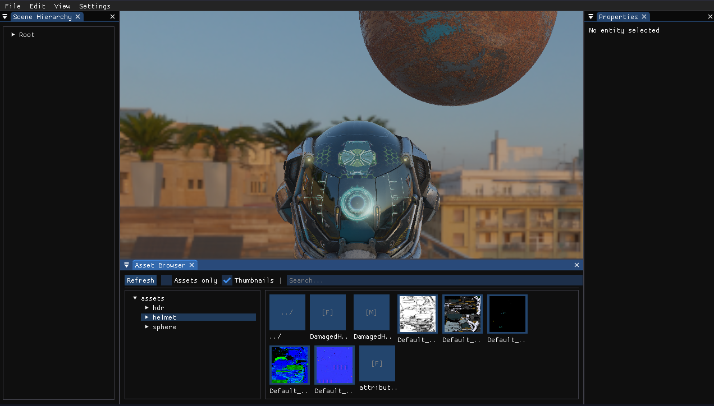
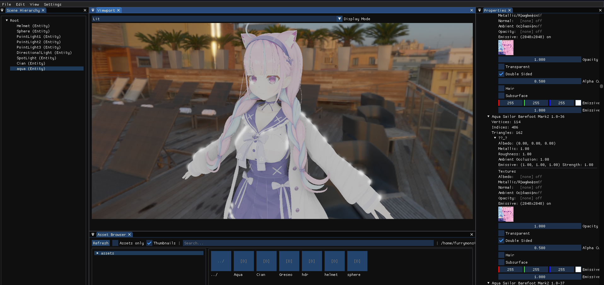
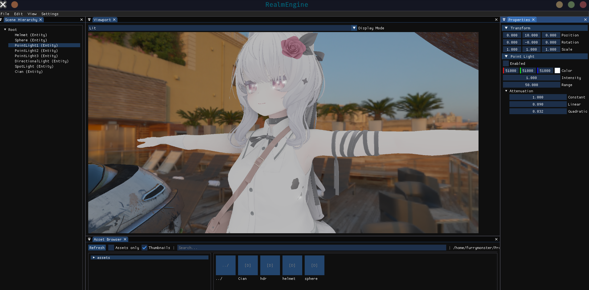

# RealmEngine

[English](README.md) | [中文](README_zh.md)

A modern OpenGL game engine with PBR rendering, a visual editor, and an ECS architecture.








## Features

- **PBR Rendering** — Cook-Torrance BRDF, Metallic/Roughness workflow, multi-pass pipeline (Shadow, GTAO, Bloom, SSS, Post-processing)
- **Image-Based Lighting** — Diffuse irradiance, specular prefiltering, BRDF LUT
- **Visual Editor** — ImGui-based scene editor with viewport, hierarchy, properties, asset browser, profiler, undo/redo, hotkeys
- **ECS Architecture** — EnTT-powered with Transform, Renderable, Camera, Lighting, Hierarchy components
- **Scene Management** — Scene graph, JSON serialization, resource caching (glTF / FBX / OBJ / PLY / STL)
- **RHI Abstraction** — OpenGL backend, architecture ready for Vulkan / D3D12

## Requirements

- **OS**: Windows / Linux / macOS
- **Compiler**: C++17 (MSVC 2017+, GCC 7+, Clang 5+)
- **CMake**: 3.20+ &ensp;|&ensp; **OpenGL**: 3.3+ &ensp;|&ensp; **Python**: 3.6+ (build scripts)

## Quick Start

```bash
git clone --recursive https://github.com/Furry-Monster/RealmEngine.git
cd RealmEngine

# Build & run (Python script)
python scripts/build.py -t Release -j 8 -r

# Or manual CMake
mkdir build && cd build
cmake .. -DCMAKE_BUILD_TYPE=Release
cmake --build . --parallel
```

After build, run `bin/RealmEditor` (or `bin/RealmEditor.exe` on Windows).

## Project Structure

```
RealmEngine/
├── engine/          # Core engine library (RHI, renderer, ECS, platform)
├── editor/          # Visual editor (panels, commands, bridge)
├── runtime/         # Standalone runtime player
├── shaders/         # GLSL shaders
├── assets/          # Models, textures, HDR environment maps
├── libs/            # Third-party dependencies (git submodules)
├── scripts/         # Build, format, lint, test scripts
└── CMakeLists.txt
```

## Dependencies

All managed as git submodules in `libs/`:

[GLFW](https://www.glfw.org/) | [GLAD](https://glad.dav1d.de/) | [GLM](https://github.com/g-truc/glm) | [Assimp](https://www.assimp.org/) | [spdlog](https://github.com/gabime/spdlog) | [ImGui](https://github.com/ocornut/imgui) | [stb](https://github.com/nothings/stb) | [EnTT](https://github.com/skypjack/entt) | [nlohmann/json](https://github.com/nlohmann/json)

## Build Options

```bash
python scripts/build.py --help

# Common usage
python scripts/build.py                    # Debug build
python scripts/build.py -t Release -j 8   # Release, 8 jobs
python scripts/build.py -c -r             # Clean, build, run
python scripts/build.py --no-editor       # Skip editor
python scripts/build.py --tests           # Enable tests

# Code quality
python scripts/format.py                  # clang-format
python scripts/lint.py                    # clang-tidy
```

See [`scripts/GUIDE.md`](scripts/GUIDE.md) for full build documentation.

## License

MIT License — see [LICENSE](LICENSE).

## Contributing

Issues and Pull Requests are welcome.
