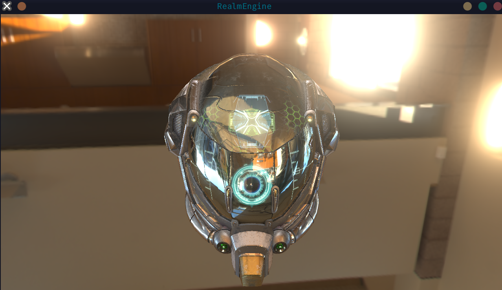
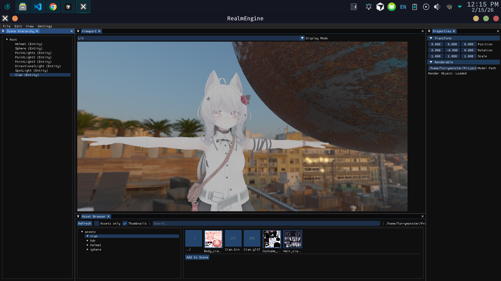
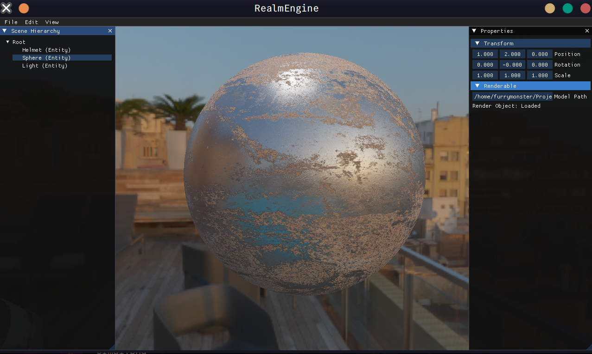
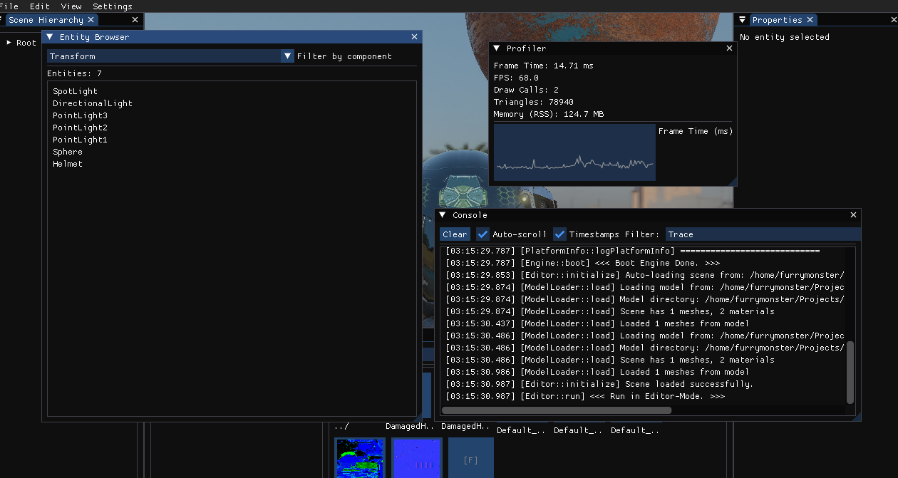

# RealmEngine

[English](README.md) | [中文](README_zh.md)

基于 OpenGL 的现代游戏引擎，采用物理渲染（PBR）管线，支持 IBL 光照与 Bloom 后处理。集成可视化编辑器与实体组件系统（ECS）。









## 核心特性

- **物理渲染（PBR）** — 金属度 / 粗糙度工作流
- **基于图像的光照（IBL）** — HDR 环境贴图与预计算光照
- **Bloom 后处理** — 可调泛光、色调映射与伽马校正
- **可视化编辑器** — ImGui 编辑器，支持场景编辑、实体管理与属性修改
- **实体组件系统（ECS）** — 组件化架构，含 Transform、Renderable、Lighting、CameraController 等
- **场景管理** — 场景创建、加载、保存与序列化
- **资源管理** — 支持 glTF、FBX 等模型格式
- **配置管理** — 统一配置，支持序列化与加密
- **窗口管理** — 基于 GLFW 的跨平台窗口
- **日志系统** — 基于 spdlog 的日志

## 运行环境

- **操作系统**: Windows / Linux / macOS
- **编译器**: C++17
  - Windows: Visual Studio 2017+ 或 MinGW
  - Linux: GCC 7+ 或 Clang 5+
  - macOS: Xcode Command Line Tools
- **CMake**: 3.20+
- **OpenGL**: 3.3+
- **Python**: 3.6+（构建脚本）

## 依赖

依赖位于 `libs/` 目录：

- **GLFW** — 窗口与输入
- **GLAD** — OpenGL 加载
- **GLM** — 数学
- **Assimp** — 模型加载
- **spdlog** — 日志
- **ImGui** — 即时模式 GUI
- **stb** — 图像加载

依赖以 submodule 管理，克隆时需一并获取：

```bash
# 方式一：递归克隆
git clone --recursive https://github.com/Furry-Monster/RealmEngine

# 方式二：分步克隆
git clone https://github.com/Furry-Monster/RealmEngine
cd RealmEngine
git submodule init
git submodule update
```

## 快速开始

### 使用构建脚本（推荐）

跨平台 Python 构建脚本：

```bash
# 默认 Debug 构建
python build.py

# Release 构建
python build.py -t Release

# 清理后构建
python build.py -c

# 构建并运行
python build.py -r

# 指定并行任务数
python build.py -j 8
```

**平台快捷脚本：**

```bash
# Windows
build.bat

# Linux / macOS
./build.sh
```

构建完成后执行 `bin/RealmEngine`（Windows 为 `bin/RealmEngine.exe`）进入编辑器。

调试模式（无编辑器界面）：

```bash
python build.py -r -- --debug
```

### 手动构建

```bash
mkdir build && cd build
cmake .. -DCMAKE_BUILD_TYPE=Debug
cmake --build . -j$(nproc)

# 运行（Linux/macOS）
../bin/RealmEngine
```

## 目录结构

```
RealmEngine/
├── build.py         # 构建入口
├── build.sh         # Unix 构建脚本
├── build.bat        # Windows 构建脚本
├── scripts/         # 构建脚本
│   ├── build.py
│   ├── build_config.py
│   ├── format.py
│   ├── lint.py
│   ├── clean.py
│   ├── test.py
│   ├── GUIDE.md
│   └── QUICKREF.md
├── assets/          # 资源（模型、纹理、HDR 等）
├── shaders/         # GLSL 着色器
├── src/             # 源码
│   ├── main.cpp
│   ├── editor/      # 编辑器
│   ├── render/      # 渲染
│   ├── resource/    # 资源管理
│   ├── gameplay/    # 游戏逻辑
│   │   ├── components/
│   │   └── scene/
│   └── ...
├── libs/            # 第三方库
├── bin/             # 输出目录
└── build/           # CMake 构建目录
```

## 构建选项

### 构建类型

- `Debug` — 调试（默认）
- `Release` — 发布优化
- `RelWithDebInfo` — 带调试信息的发布
- `MinSizeRel` — 最小体积

### 构建脚本参数

```bash
python build.py --help

常用参数：
  -t, --type TYPE        构建类型
  -d, --dir DIR          构建目录（默认 build）
  -g, --generator GEN    CMake 生成器
  -j, --jobs N           并行任务数
  -c, --clean            清理
  -r, --run              构建后运行
  -v, --verbose          详细输出
  --configure            仅配置
  --build                仅构建
  -D VAR=VALUE           传递 CMake 变量
```

### 辅助工具

```bash
# 代码格式化
python scripts/format.py
python scripts/format.py --check

# 代码检查
python scripts/lint.py
python scripts/lint.py --fix

# 清理
python scripts/clean.py
python scripts/clean.py --all

# 测试
python scripts/test.py
```

更多说明见 `scripts/GUIDE.md` 与 `scripts/QUICKREF.md`。

## 编辑器

编辑器面板：

- **菜单栏** — 文件（新建、打开、保存场景）、编辑等
- **场景层级** — 实体与节点列表，支持选择与操作
- **属性面板** — 编辑选中实体的组件（Transform、Renderable、Lighting 等）
- **视口** — 实时场景预览
- **文件对话框** — 打开与保存场景

场景以 JSON 格式存储，支持完整序列化与反序列化。

## 资源

- **模型**: glTF、FBX 等（Assimp）
- **纹理**: 常见格式（stb_image）
- **HDR 环境贴图**: .hdr（IBL）

资源放在 `assets/`，构建时复制到 `bin/assets/`。

## 着色器

`shaders/` 目录：

- `pbr.vert/frag` — PBR 主着色器
- `skybox.vert/frag` — 天空盒
- `bloom.vert/frag` — Bloom
- `post.vert/frag` — 后处理
- `ibl/` — IBL 相关

## 许可证

见项目根目录 [LICENSE](LICENSE)。

## 贡献

欢迎提交 Issue 与 Pull Request。
