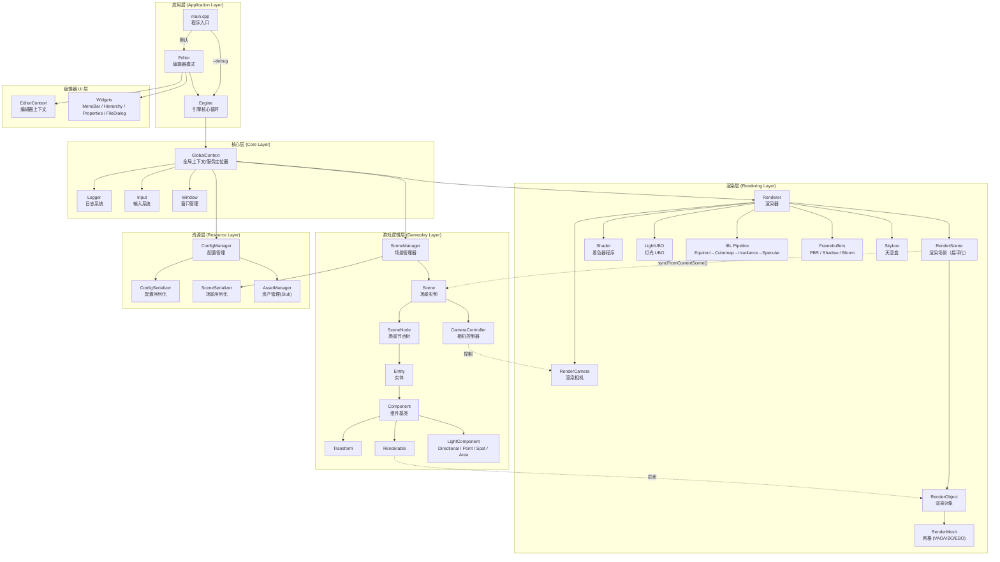
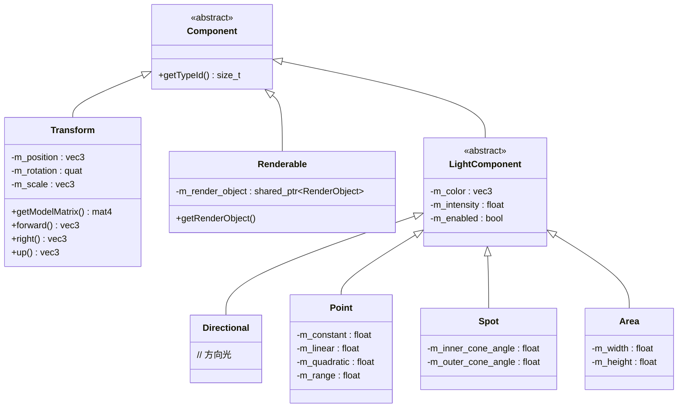
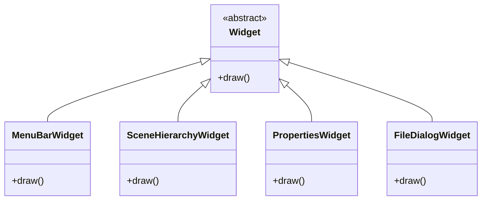
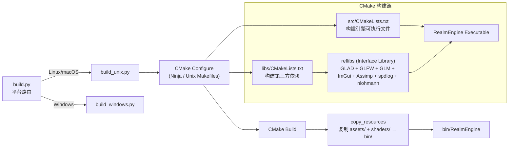
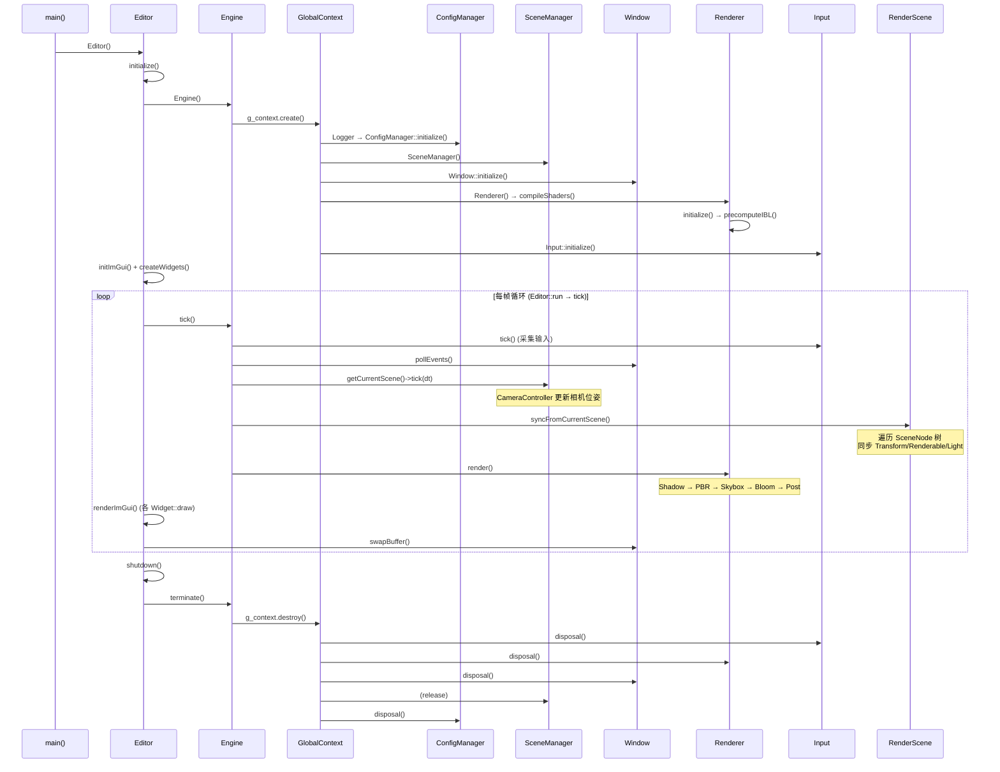

# RealmEngine 项目技术架构白皮书

> **文档版本**: v1.0  
> **生成日期**: 2026-02-12  
> **代码库**: RealmEngine v0.1.0

---

## 目录

1. [项目概览 (Project Overview)](#1-项目概览-project-overview)
2. [系统架构设计 (System Architecture)](#2-系统架构设计-system-architecture)
3. [目录结构说明 (Directory Structure)](#3-目录结构说明-directory-structure)
4. [核心模块详解 (Core Modules)](#4-核心模块详解-core-modules)
5. [数据模型 (Data Models)](#5-数据模型-data-models)
6. [环境与部署 (Setup & Deployment)](#6-环境与部署-setup--deployment)

---

## 1. 项目概览 (Project Overview)

### 1.1 核心功能

RealmEngine 是一个基于 **OpenGL 3.3** 的现代游戏引擎，专注于 **基于物理的渲染 (PBR)** 和高质量图形效果。它提供了一套完整的可视化编辑器、实体组件系统（EC）、场景管理以及资源管理能力，旨在为开发者提供一个集"渲染引擎 + 场景编辑器"于一体的图形开发框架。

**核心能力概述**：

- **PBR 渲染** —— 支持金属度/粗糙度工作流 (Metallic/Roughness Workflow)
- **基于图像的光照 (IBL)** —— 支持 HDR 环境贴图、漫反射辐照度图、预滤波环境贴图、BRDF 卷积查找表
- **多光源系统** —— 支持方向光 (Directional)、点光源 (Point)、聚光灯 (Spot)、面光源 (Area)，通过 UBO 高效传输至 GPU
- **后处理管线** —— Bloom 泛光（Ping-Pong 高斯模糊 + Mip Chain）、色调映射 (Tonemapping)、伽马校正 (Gamma Correction)
- **阴影映射** —— 基于方向光的正交投影 Shadow Map
- **可视化编辑器** —— 基于 ImGui 的完整编辑器（场景层次面板、属性面板、菜单栏、文件对话框）
- **实体组件系统** —— 轻量级 Entity-Component 架构
- **场景序列化** —— JSON 格式的场景加载/保存，支持可选加密

### 1.2 技术栈 (Tech Stack)

| 类别 | 技术 | 版本/说明 |
|------|------|-----------|
| **编程语言** | C++17 | 主语言，强制 C++17 标准 |
| **着色器语言** | GLSL | OpenGL Shading Language |
| **图形 API** | OpenGL 3.3+ | 通过 GLAD 加载 |
| **窗口/输入** | GLFW | 跨平台窗口、输入、OpenGL Context 管理 |
| **数学库** | GLM | 向量、矩阵、四元数运算 |
| **UI 框架** | Dear ImGui | 即时模式 GUI（含 Docking 支持） |
| **模型加载** | Assimp | 支持 glTF、FBX、OBJ、PLY、STL 等格式 |
| **图像加载** | stb_image | 支持 JPG、PNG、HDR 等格式 |
| **日志系统** | spdlog | 高性能 C++ 日志库 |
| **JSON 处理** | nlohmann/json | 单头文件 JSON 库，用于配置与场景序列化 |
| **构建系统** | CMake 3.20+ | 支持 Ninja / Unix Makefiles 生成器 |
| **构建脚本** | Python 3.6+ | 封装 CMake 构建流程的便捷脚本 |
| **代码质量** | clang-format + clang-tidy | 代码格式化与静态分析 |
| **依赖管理** | Git Submodules + Vendored | 无包管理器，所有依赖内置于 `libs/` |

---

## 2. 系统架构设计 (System Architecture)

### 2.1 架构模式

RealmEngine 采用 **分层架构 + 组件化设计** 的混合模式：

- **全局上下文模式 (Global Context / Service Locator)**：通过 `GlobalContext` 单例持有所有核心子系统的共享指针，各模块通过 `g_context` 访问彼此，避免紧耦合的依赖注入。
- **Entity-Component (EC) 模式**：非严格 ECS，Entity 持有 Component Map，Component 通过 `std::type_index::hash_code()` 进行类型标识。无独立的 System 注册机制，逻辑分散在 `Scene::tick()`、`RenderScene::syncNode()`、`Renderer::render()` 中。
- **Scene Graph（场景图）**：`SceneNode` 构建树状层级，每个节点可关联一个 Entity，支持父子关系遍历。
- **逻辑/渲染分离**：Gameplay 层（`Scene`、`Entity`、`Component`）与 Render 层（`RenderScene`、`RenderObject`、`Renderer`）独立存在，通过 `RenderScene::syncFromCurrentScene()` 进行每帧数据同步。

### 2.2 高层架构图



### 2.3 渲染管线流程图

```mermaid
graph LR
    subgraph ShadowPass["1. Shadow Pass"]
        SP1["绑定 ShadowFramebuffer"]
        SP2["设置正交投影 + 光源视图"]
        SP3["渲染所有 RenderObject 到深度贴图"]
    end

    subgraph MainPass["2. PBR Main Pass"]
        MP1["绑定 PBRFramebuffer (HDR双缓冲)"]
        MP2["设置 Camera VP 矩阵"]
        MP3["绑定 LightUBO"]
        MP4["绑定 IBL 贴图<br/>(Irradiance + Prefiltered + BRDF LUT)"]
        MP5["绑定 Shadow Map"]
        MP6["逐对象设置 Model 矩阵并 Draw"]
    end

    subgraph SkyboxPass["3. Skybox Pass"]
        SKY1["使用去除平移的 View 矩阵"]
        SKY2["绘制 HDR Cubemap 天空盒"]
    end

    subgraph BloomPass["4. Bloom Pass"]
        BL1["从 PBR 亮度缓冲生成 Mipmap"]
        BL2["逐 Mip Level 执行 Ping-Pong 高斯模糊"]
    end

    subgraph PostPass["5. Post-Processing Pass"]
        PP1["绑定默认 Framebuffer"]
        PP2["合并 HDR Color + Bloom 纹理"]
        PP3["Tonemapping + Gamma Correction"]
        PP4["输出至屏幕"]
    end

    ShadowPass --> MainPass --> SkyboxPass --> BloomPass --> PostPass
```



### 2.4 核心数据流向

引擎的数据流可概括为 **"配置 → 场景 → 同步 → 渲染"** 四阶段闭环：

1. **启动阶段**：`GlobalContext::create()` 按序初始化各子系统：Logger → ConfigManager（加载 `config.json`）→ SceneManager → Window（创建 GLFW 窗口）→ Renderer（编译 Shader、预计算 IBL）→ Input。

2. **场景加载阶段**：`SceneManager` 通过 `SceneSerializer` 从 JSON 文件反序列化出 `Scene`，构建 `SceneNode` 树，创建 `Entity` 并挂载 `Component`（Transform、Renderable、各类 Light）。`Renderable` 组件在创建时通过 Assimp 加载 3D 模型，生成 `RenderObject` → `RenderMesh` → OpenGL 缓冲。

3. **帧循环阶段**：每帧执行 `Engine::tick()`：
   - **逻辑更新** (`logicalTick`)：Input 状态采集 → Window 事件轮询 → Scene 逻辑更新（CameraController 根据输入更新 RenderCamera 的位姿）
   - **渲染更新** (`renderTick`)：`RenderScene::syncFromCurrentScene()` 遍历场景图，将 Entity 的 Transform/Renderable/Light 信息同步到扁平化的 `m_render_objects` 和 `m_lights` 列表中 → `Renderer::render()` 执行五阶段渲染管线。

4. **退出阶段**：保存当前场景到 JSON → `GlobalContext::destroy()` 按逆序销毁所有子系统。

---

## 3. 目录结构说明 (Directory Structure)

```
RealmEngine/
├── assets/                          # 运行时资源文件
│   ├── hdr/                         # HDR 环境贴图 (.hdr)，用于 IBL
│   │   ├── arches_pinetree.hdr
│   │   ├── barcelona_rooftop.hdr
│   │   ├── circus_backstage.hdr
│   │   └── newport_loft.hdr
│   └── helmet/                      # 示例 glTF 模型 (DamagedHelmet)
│       ├── DamagedHelmet.gltf       # glTF 场景描述
│       ├── DamagedHelmet.bin        # 二进制几何数据
│       └── Default_*.jpg            # PBR 纹理 (albedo, normal, metalRoughness, AO, emissive)
│
├── shaders/                         # GLSL 着色器源文件
│   ├── pbr.vert / pbr.frag         # PBR 主着色器（金属/粗糙度工作流 + IBL + Shadow）
│   ├── skybox.vert / skybox.frag   # HDR 天空盒渲染
│   ├── bloom.vert / bloom.frag     # Bloom 高斯模糊
│   ├── post.vert / post.frag       # 后处理（Tonemapping + Gamma + Bloom 合成）
│   ├── shadow.vert / shadow.frag   # Shadow Map 深度渲染
│   └── ibl/                         # IBL 预计算着色器
│       ├── hdricube.*               # HDR Equirectangular → Cubemap
│       ├── diffuseirradiance.*      # 漫反射辐照度卷积
│       ├── specularenv.*            # 预滤波环境贴图
│       └── brdfconvolution.*        # BRDF 积分查找表
│
├── src/                             # 引擎源代码
│   ├── main.cpp                     # ★ 程序入口：Editor 模式 / Debug 模式分支
│   ├── engine.h / engine.cpp        # ★ 引擎核心：boot → tick(逻辑+渲染) → terminate
│   ├── global_context.h / .cpp      # ★ 全局上下文：持有所有子系统的共享指针
│   ├── window.h / .cpp              # 窗口管理：GLFW 窗口创建、事件回调
│   ├── input.h / .cpp               # 输入系统：键盘/鼠标状态管理
│   ├── logger.h / .cpp              # 日志系统：基于 spdlog 的封装
│   ├── math.h                       # 数学工具宏/辅助
│   ├── utils.h                      # 通用工具宏（日志快捷方式等）
│   │
│   ├── editor/                      # 编辑器系统
│   │   ├── editor.h / .cpp          # 编辑器主控：初始化 ImGui、管理 Widget 面板
│   │   ├── editor_context.h / .cpp  # 编辑器上下文：选中实体/节点状态
│   │   ├── widget.h                 # Widget 抽象基类
│   │   └── widgets/                 # 具体编辑器组件
│   │       ├── menu_bar_widget.*    # 菜单栏（新建/打开/保存场景）
│   │       ├── scene_hierarchy_widget.* # 场景层次面板（节点树展示）
│   │       ├── properties_widget.*  # 属性面板（Transform/Light/Renderable 编辑）
│   │       └── file_dialog_widget.* # 文件对话框
│   │
│   ├── gameplay/                    # 游戏逻辑层
│   │   ├── entity.h / .cpp          # Entity：ID + ComponentSet
│   │   ├── component.h / .cpp       # Component 抽象基类
│   │   ├── components/              # 具体组件
│   │   │   ├── transform.h / .cpp   # Transform：位置/旋转(四元数)/缩放
│   │   │   ├── renderable.h / .cpp  # Renderable：关联 RenderObject
│   │   │   ├── camera_controller.h / .cpp # 相机控制器（FPS 风格）
│   │   │   └── lighting/            # 灯光组件
│   │   │       ├── light_component.h / .cpp  # 灯光基类
│   │   │       ├── directional.h / .cpp      # 方向光
│   │   │       ├── point.h / .cpp            # 点光源
│   │   │       ├── spot.h / .cpp             # 聚光灯
│   │   │       └── area.h / .cpp             # 面光源
│   │   └── scene/                   # 场景管理
│   │       ├── scene.h / .cpp       # Scene：根节点 + Entity Map + CameraController
│   │       ├── scene_node.h / .cpp  # SceneNode：树节点，关联 Entity ID
│   │       ├── scene_manager.h / .cpp    # SceneManager：场景创建/加载/切换
│   │       └── scene_serializer.h / .cpp # SceneSerializer：JSON 序列化/反序列化
│   │
│   ├── render/                      # 渲染层
│   │   ├── renderer.h / .cpp        # ★ 渲染器核心：五阶段管线调度
│   │   ├── render_scene.h / .cpp    # RenderScene：场景数据扁平化同步
│   │   ├── render_camera.h / .cpp   # 渲染相机：View/Projection 矩阵
│   │   ├── render_object.h / .cpp   # RenderObject：Assimp 模型加载 + Draw
│   │   ├── render_mesh.h / .cpp     # RenderMesh：单个 Mesh (VAO/VBO/EBO)
│   │   ├── render_material.h        # RenderMaterial：PBR 材质（纹理集）
│   │   ├── shader.h / .cpp          # Shader：GLSL 编译/链接/Uniform 管理
│   │   ├── light.h / .cpp           # Light + LightData + LightUBO
│   │   ├── texture.h                # Texture：OpenGL 纹理 ID 封装
│   │   ├── vertex.h                 # RenderVertex：顶点数据结构
│   │   ├── skybox.h / .cpp          # Skybox：Cubemap 天空盒绘制
│   │   ├── fullscreen_quad.h / .cpp # 全屏四边形（后处理用）
│   │   ├── cube.h / .cpp            # 辅助 Cube 几何体
│   │   ├── pbr_framebuffer.h / .cpp    # PBR FBO（HDR 双附件）
│   │   ├── bloom_framebuffer.h / .cpp  # Bloom FBO（Mip Level 支持）
│   │   ├── shadow_framebuffer.h / .cpp # Shadow Map FBO
│   │   └── ibl/                     # IBL 预计算管线
│   │       ├── equirectangular_cubemap.*    # HDR → Cubemap 转换
│   │       ├── diffuse_irradiance_map.*     # 漫反射辐照度图计算
│   │       ├── specular_map.*               # 预滤波环境贴图 + BRDF LUT
│   │       ├── hdr_texture.*                # HDR 纹理加载
│   │       ├── hdri_cube.*                  # HDRI 立方体辅助
│   │       ├── cubemap_framebuffer.*        # Cubemap FBO
│   │       ├── mipmap_cubemap_framebuffer.* # 带 Mipmap 的 Cubemap FBO
│   │       └── brdf_convolution_framebuffer.* # BRDF 卷积 FBO
│   │
│   ├── resource/                    # 资源管理层
│   │   ├── config_manager.h / .cpp  # ConfigManager：配置加载/存储
│   │   ├── config_serializer.h / .cpp # ConfigSerializer：config.json 读写
│   │   └── asset_manager.h / .cpp   # AssetManager：资产管理（当前为 Stub）
│   │
│   └── plateform/                   # 平台适配层
│       └── plateform.h / .cpp       # 平台相关工具函数
│
├── libs/                            # 第三方依赖库
│   ├── CMakeLists.txt               # 统一构建脚本，输出 reflibs 接口库
│   ├── glad/                        # OpenGL 函数加载器（Vendored）
│   ├── glfw/                        # 窗口/输入（Git Submodule）
│   ├── glm/                         # 数学库（Git Submodule）
│   ├── imgui/                       # ImGui GUI（Git Submodule）
│   ├── assimp/                      # 模型加载（Git Submodule）
│   ├── spdlog/                      # 日志库（Git Submodule）
│   ├── stb/                         # 图像加载（Git Submodule）
│   └── nlohmann/                    # JSON 库（Vendored 单头文件）
│
├── CMakeLists.txt                   # ★ 根 CMake 配置
├── build.py                         # 构建路由脚本（自动选择平台）
├── build_unix.py                    # Unix 构建脚本（Ninja/Make）
├── build_windows.py                 # Windows 构建脚本
├── .clang-format                    # 代码格式化配置（Mozilla 风格）
├── .clang-tidy                      # 静态分析配置
├── .editorconfig                    # 编辑器配置
├── .gitmodules                      # Git Submodule 定义
├── README.md                        # 项目说明文档
└── LICENSE                          # MIT 许可证
```

---

## 4. 核心模块详解 (Core Modules)

### 4.1 渲染器模块 (Renderer)

| 属性 | 说明 |
|------|------|
| **所在路径** | `src/render/` |
| **职责** | 管理整个渲染管线：Shader 编译、IBL 预计算、五阶段渲染调度（Shadow → PBR → Skybox → Bloom → Post） |

**关键类/函数**：

| 类/函数 | 职责 |
|---------|------|
| `Renderer` | 渲染器核心类，持有所有 Shader、Framebuffer、IBL 资源；`initialize()` 初始化 OpenGL 状态和 FBO；`render()` 执行完整渲染管线 |
| `Renderer::compileShaders()` | 编译 PBR、Bloom、Post、Skybox、Shadow 五套 Shader |
| `Renderer::precomputeIBL()` | 预计算 IBL 管线：Equirectangular → Cubemap → Diffuse Irradiance → Specular Prefiltered → BRDF LUT |
| `Renderer::renderShadow()` | Shadow Pass：查找方向光，正交投影渲染深度图 |
| `Renderer::renderBloom()` | Bloom Pass：逐 Mip Level Ping-Pong 高斯模糊 |
| `Renderer::applyPostprocess()` | Post Pass：HDR Color + Bloom 合成 → Tonemapping → Gamma |
| `RenderScene` | 渲染场景容器，`syncFromCurrentScene()` 每帧从 Scene 同步数据到 `m_render_objects` 和 `m_lights` |
| `RenderObject` | 模型渲染对象，通过 Assimp 加载模型并管理多个 `RenderMesh` |
| `RenderMesh` | 单个网格：持有 VAO/VBO/EBO 和 `RenderMaterial` |
| `RenderCamera` | 渲染相机：管理 View/Projection 矩阵、Frustum 参数 |
| `Shader` | GLSL Shader 程序封装：编译、链接、Uniform 设置 |
| `LightUBO` | 灯光 Uniform Buffer Object：将最多 16 盏灯打包上传到 GPU |
| `Skybox` | Cubemap 天空盒的绘制 |

**依赖关系**：
- **依赖**：`Window`（获取窗口尺寸）、`ConfigManager`（读取渲染配置）、`Scene`（通过 RenderScene 同步数据）
- **被依赖**：`Engine`（调用 `render()`）、`Editor`（获取 RenderCamera）

---

### 4.2 场景管理模块 (Scene Management)

| 属性 | 说明 |
|------|------|
| **所在路径** | `src/gameplay/scene/` |
| **职责** | 管理场景的生命周期（创建、加载、保存、切换），维护场景图层级结构 |

**关键类/函数**：

| 类/函数 | 职责 |
|---------|------|
| `SceneManager` | 场景管理器：管理多个 `Scene` 实例，维护当前场景引用；提供 `loadScene()`、`saveCurrentScene()`、`createDefaultScene()`；支持 `setOnSceneChanged()` 回调通知 |
| `Scene` | 单个场景实例：持有根 `SceneNode`、Entity Map、`CameraController`；`createEntity()`/`createNode()`/`createNodeWithEntity()` 创建场景内容；`tick(delta_time)` 驱动逻辑更新 |
| `SceneNode` | 场景图节点：名称 + 可选 Entity ID + 父/子指针；支持 `addChild()`、`removeChild()` 层级操作；使用 `enable_shared_from_this` 管理生命周期 |
| `SceneSerializer` | 场景序列化器：`loadFromFile()` 从 JSON 反序列化场景（递归构建节点树 + 创建 Entity + 挂载 Component）；`saveToFile()` 将场景序列化为 JSON；支持可选的 XOR + Base64 加密 |

**依赖关系**：
- **依赖**：`Entity`、`Component`（各类组件）、`SceneSerializer`（序列化）、`nlohmann/json`
- **被依赖**：`Engine`（场景 tick）、`RenderScene`（同步渲染数据）、`Editor`（场景编辑操作）

---

### 4.3 实体组件模块 (Entity-Component)

| 属性 | 说明 |
|------|------|
| **所在路径** | `src/gameplay/entity.*`、`src/gameplay/component.*`、`src/gameplay/components/` |
| **职责** | 提供灵活的组件化对象模型，支持动态组件挂载/查询/移除 |

**关键类/函数**：

| 类/函数 | 职责 |
|---------|------|
| `Component` | 抽象基类：`virtual getTypeId()` 返回类型标识；Non-copyable, Movable |
| `Entity` | 实体：ID + `ComponentSet`（`unordered_map<size_t, shared_ptr<Component>>`）；模板方法 `addComponent<T>()`、`getComponent<T>()`、`hasComponent<T>()`、`removeComponent<T>()` |
| `Transform` | 位置 (`glm::vec3`)、旋转 (`glm::quat`)、缩放 (`glm::vec3`)；`getModelMatrix()` 生成模型矩阵；提供 `forward()`/`right()`/`up()` 方向向量 |
| `Renderable` | 关联 `RenderObject`；构造时可通过模型路径自动加载 3D 资产 |
| `LightComponent` | 灯光组件抽象基类：颜色、强度、启用状态 |
| `Directional` / `Point` / `Spot` / `Area` | 具体灯光类型：方向光、点光源（衰减/范围）、聚光灯（锥角）、面光源（宽高） |
| `CameraController` | 相机控制器：基于输入的 FPS 风格相机控制；直接操作 `RenderCamera` 的位姿 |

**组件继承体系**：



**依赖关系**：
- **依赖**：`RenderObject`（Renderable 持有）、`RenderCamera`（CameraController 操控）、`Input`（CameraController 读取输入）
- **被依赖**：`Scene`（管理 Entity 生命周期）、`RenderScene`（同步组件数据）、`SceneSerializer`（序列化/反序列化组件）、`Editor Widgets`（属性面板编辑）

---

### 4.4 编辑器模块 (Editor)

| 属性 | 说明 |
|------|------|
| **所在路径** | `src/editor/` |
| **职责** | 提供基于 ImGui 的可视化编辑界面，支持场景编辑、实体管理和属性调整 |

**关键类/函数**：

| 类/函数 | 职责 |
|---------|------|
| `Editor` | 编辑器主控类：初始化 ImGui（含 Docking 支持）、管理 Widget 面板列表；`initialize()` → `run()`（主循环）→ `shutdown()`；内部持有 `Engine` 实例驱动引擎帧循环 |
| `EditorContext` | 编辑器上下文：维护 `m_selected_entity` 和 `m_selected_node` 状态，供各 Widget 共享 |
| `Widget` | 抽象基类：定义 `draw()` 接口 |
| `MenuBarWidget` | 菜单栏：文件操作（新建/打开/保存场景） |
| `SceneHierarchyWidget` | 场景层次面板：以树形结构展示 SceneNode，支持节点选择 |
| `PropertiesWidget` | 属性面板：编辑选中 Entity 的 Transform、Renderable、Lighting 等组件属性 |
| `FileDialogWidget` | 文件对话框：场景文件的打开/保存 |

**Widget 结构**：



**依赖关系**：
- **依赖**：`Engine`（驱动帧循环）、`EditorContext`（共享选中状态）、`SceneManager`（场景操作）、`GlobalContext`（访问子系统）、ImGui
- **被依赖**：`main.cpp`（作为默认启动入口）

---

### 4.5 资源与配置模块 (Resource & Config)

| 属性 | 说明 |
|------|------|
| **所在路径** | `src/resource/` |
| **职责** | 管理引擎配置的加载/存储和资产管理 |

**关键类/函数**：

| 类/函数 | 职责 |
|---------|------|
| `ConfigManager` | 配置管理器：持有四类配置结构体（`GeneralConfig`/`WindowConfig`/`RendererConfig`/`GamePlayConfig`）；`initialize()` 时通过 `ConfigSerializer` 从 `config.json` 加载 |
| `ConfigSerializer` | 配置序列化器：JSON ↔ Config 结构体的双向转换；支持可选 XOR + Base64 加密 |
| `AssetManager` | 资产管理器（当前为 Stub，预留扩展接口） |

**配置结构概览**：

| 配置结构体 | 关键字段 |
|-----------|---------|
| `GeneralConfig` | `root_folder`、`asset_folder`、`shader_folder` |
| `WindowConfig` | `width`(1280)、`height`(720)、`title`、`vsync`、`msaa_samples`(4) |
| `RendererConfig` | `camera_fov`(45°)、`bloom_*` 系列、`tonemapping_enabled`、`gamma_correction_factor`(2.2)、`hdri_path` |
| `GamePlayConfig` | `camera_move_speed`(5.0)、`camera_sprint_multiplier`(2.0)、`scene_file`("scene.json")、`max_delta_time`(0.1) |

**依赖关系**：
- **依赖**：`nlohmann/json`、文件系统
- **被依赖**：`GlobalContext`（初始化时加载）、`Renderer`（读取渲染参数）、`Window`（读取窗口参数）、`Engine`（读取游戏逻辑参数）

---

## 5. 数据模型 (Data Models)

### 5.1 核心数据结构关系图

```mermaid
erDiagram
    GlobalContext ||--|| Logger : holds
    GlobalContext ||--|| ConfigManager : holds
    GlobalContext ||--|| AssetManager : holds
    GlobalContext ||--|| SceneManager : holds
    GlobalContext ||--|| Window : holds
    GlobalContext ||--|| Renderer : holds
    GlobalContext ||--|| Input : holds

    SceneManager ||--o{ Scene : manages
    Scene ||--|| SceneNode : "root"
    Scene ||--o{ Entity : "m_entities (by hash)"
    Scene ||--|| CameraController : owns

    SceneNode ||--o{ SceneNode : "children"
    SceneNode }o--o| Entity : "m_entity_id"

    Entity ||--o{ Component : "ComponentSet"
    Component <|-- Transform : extends
    Component <|-- Renderable : extends
    Component <|-- LightComponent : extends
    LightComponent <|-- Directional : extends
    LightComponent <|-- Point : extends
    LightComponent <|-- Spot : extends
    LightComponent <|-- Area : extends

    Renderable ||--|| RenderObject : wraps
    RenderObject ||--o{ RenderMesh : "m_meshes"
    RenderMesh ||--|| RenderMaterial : "m_material"
    RenderMaterial ||--o{ Texture : "albedo/normal/metallic/AO/emissive"

    Renderer ||--|| RenderScene : owns
    Renderer ||--|| RenderCamera : owns
    Renderer ||--|| LightUBO : owns
    RenderScene ||--o{ RenderObject : "m_render_objects"
    RenderScene ||--o{ Light : "m_lights"

    CameraController ..> RenderCamera : controls
    RenderScene ..> Scene : "syncFromCurrentScene()"
```

### 5.2 Gameplay 层状态管理

Gameplay 层采用 **Scene Graph + Entity-Component** 模式管理状态：

- **Scene** 作为状态根容器，持有：
  - `m_root`：`SceneNode` 树的根节点
  - `m_entities`：以名称哈希为 Key 的 Entity Map
  - `m_camera_controller`：场景级相机控制器

- **SceneNode** 构建层级关系树，每个节点通过 `m_entity_id` 可选地关联一个 Entity。

- **Entity** 是一个纯粹的组件容器，以 `std::type_index::hash_code()` 为 Key 的 `unordered_map` 存储组件，支持运行时动态增删查改。

- **SceneManager** 通过 `m_scenes` (name → Scene) 管理多场景，`m_current_scene` 指向当前活跃场景，提供 `setOnSceneChanged()` 回调通知观察者。

### 5.3 Render 层状态管理

Render 层与 Gameplay 层 **解耦**，通过同步机制桥接：

- **RenderScene** 每帧通过 `syncFromCurrentScene()` 遍历 `Scene` 的 `SceneNode` 树：
  - 提取 `Transform` → 设置 `RenderObject` 的位置/旋转/缩放
  - 提取 `Renderable` → 收集 `RenderObject` 到 `m_render_objects`
  - 提取 `LightComponent` → 转换为 `Light` POD 结构加入 `m_lights`

- **LightUBO** 将 `m_lights` 列表打包为 GPU 友好的 `LightData` 数组（最多 16 盏灯），通过 OpenGL UBO 上传。

### 5.4 场景序列化格式 (JSON Schema)

场景文件 (`scene.json`) 的逻辑结构：

```json
{
  "root": {
    "name": "Root",
    "entity": null,
    "children": [
      {
        "name": "Helmet",
        "entity": {
          "name": "Helmet",
          "components": {
            "Transform": {
              "position": [0, 0, 0],
              "rotation": [0, 0, 0, 1],
              "scale": [1, 1, 1]
            },
            "Renderable": {
              "model_path": "helmet/DamagedHelmet.gltf"
            }
          }
        },
        "children": []
      },
      {
        "name": "SunLight",
        "entity": {
          "name": "SunLight",
          "components": {
            "Transform": { "position": [0, 5, 0] },
            "Directional": {
              "color": [1, 1, 1],
              "intensity": 1.0
            }
          }
        },
        "children": []
      }
    ]
  }
}
```

### 5.5 配置文件格式 (config.json Schema)

```json
{
  "general": {
    "root_folder": ".",
    "asset_folder": "assets",
    "shader_folder": "shaders"
  },
  "window": {
    "width": 1280,
    "height": 720,
    "title": "RealmEngine",
    "vsync": true,
    "msaa_samples": 4
  },
  "renderer": {
    "camera_fov": 45.0,
    "bloom_enabled": true,
    "bloom_intensity": 1.0,
    "tonemapping_enabled": true,
    "gamma_correction_factor": 2.2,
    "hdri_path": "hdr/barcelona_rooftop.hdr"
  },
  "gameplay": {
    "camera_move_speed": 5.0,
    "scene_file": "scene.json",
    "max_delta_time": 0.1
  }
}
```

---

## 6. 环境与部署 (Setup & Deployment)

### 6.1 系统要求

| 要求 | 最低版本 |
|------|---------|
| **操作系统** | Linux / macOS（Windows 暂不支持 MSVC，可用 MinGW） |
| **编译器** | GCC 7+ / Clang 5+（需支持 C++17） |
| **CMake** | 3.20+ |
| **OpenGL** | 3.3+ |
| **Python** | 3.6+（用于构建脚本，非必须） |

### 6.2 本地开发环境搭建

```bash
# 1. 克隆仓库（含子模块）
git clone --recursive https://github.com/Furry-Monster/Realm
cd Realm

# 如已克隆，补充拉取子模块
git submodule init && git submodule update

# 2. 使用构建脚本（推荐）
python build.py                    # 默认 Debug 构建
python build.py --type Release     # Release 构建
python build.py --run              # 构建并运行编辑器
python build.py --run --debug      # 构建并运行无编辑器调试模式
python build.py --clean --run      # 清理重建并运行

# 3. 手动构建（不使用 Python 脚本）
mkdir build && cd build
cmake .. -DCMAKE_BUILD_TYPE=Debug -G Ninja
cmake --build . -j$(nproc)
cd ..
./bin/RealmEngine                  # 启动编辑器
./bin/RealmEngine debug            # 启动调试模式
```

### 6.3 构建系统详解

**构建流程图**：



**构建产物结构**：

```
bin/
├── RealmEngine              # 引擎可执行文件
├── assets/                  # 运行时资源（从项目根 assets/ 复制）
│   ├── hdr/
│   └── helmet/
├── shaders/                 # 运行时着色器（从项目根 shaders/ 复制）
└── lib/                     # 库文件输出目录
```

### 6.4 构建脚本选项一览

```bash
python build.py [选项]

选项：
  -t, --type TYPE         构建类型 (Debug / Release / RelWithDebInfo / MinSizeRel)
  -d, --dir DIR           构建目录（默认: build）
  -g, --generator GEN     CMake 生成器（默认: Ninja）
  -j, --jobs N            并行编译任务数
  -c, --clean             清理构建目录后重新构建
  -r, --run               构建后自动运行
  -v, --verbose           详细输出
  --configure             仅执行 CMake 配置
  --build                 仅执行编译（跳过配置）
  --format                使用 clang-format 格式化代码
  --lint                  使用 clang-tidy 执行代码检查
  --lint-fix              使用 clang-tidy 检查并自动修复
```

### 6.5 代码质量工具

| 工具 | 配置文件 | 用途 |
|------|---------|------|
| **clang-format** | `.clang-format` | 代码格式化（Mozilla 风格，120 列，4 空格缩进） |
| **clang-tidy** | `.clang-tidy` | 静态分析（命名规范、现代化、可读性、Bug 检测） |

```bash
# 格式化
python build.py --format

# 静态检查
python build.py --lint

# 自动修复
python build.py --lint-fix
```

### 6.6 CI/CD 与 Docker

> **当前状态**：项目尚未配置 CI/CD 管线或 Docker 容器化部署。构建和运行完全依赖本地开发环境。

---

## 附录：引擎生命周期时序图



---

> **文档结束**。本白皮书基于对 RealmEngine 代码库的深度逆向分析生成，覆盖了从系统架构到实现细节的各个层面。如需进一步了解某个模块的实现细节，建议直接阅读对应源文件。
