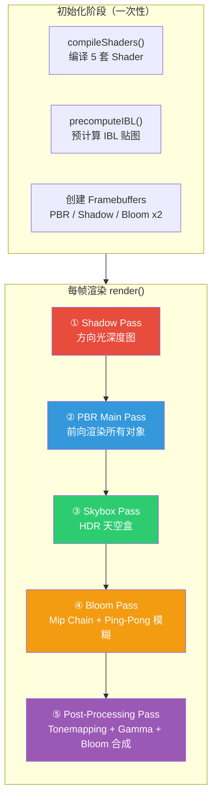
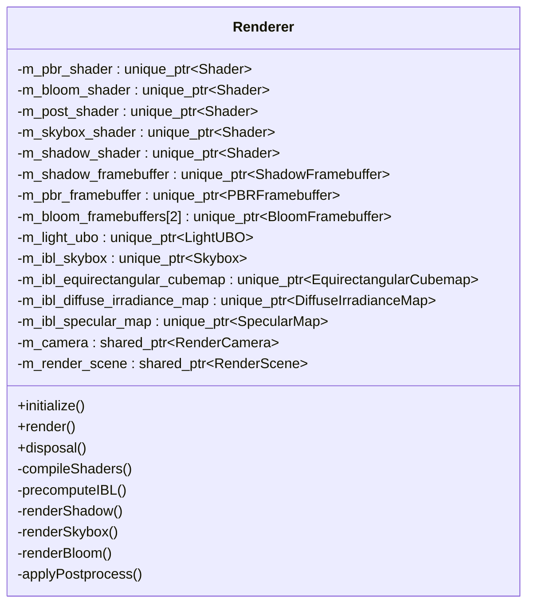
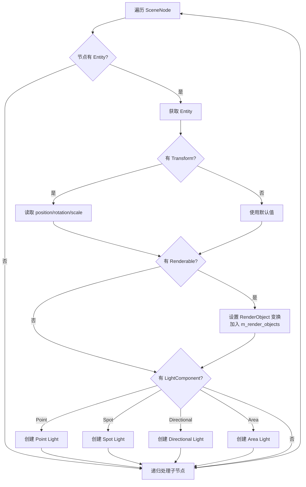
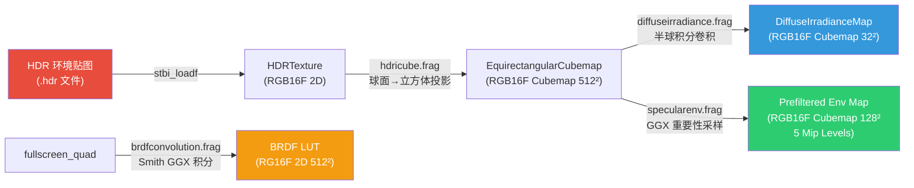
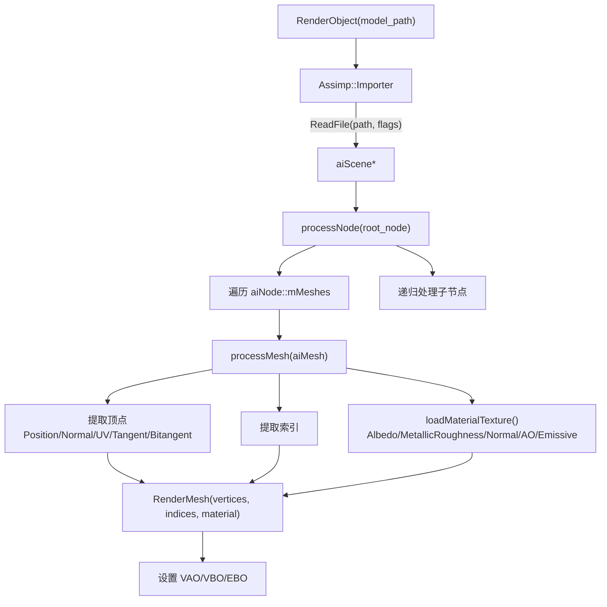

# 渲染模块详细设计文档 (Rendering Module)

> **模块路径**: `src/render/`  
> **核心文件数**: 29 个（14 头文件 + 15 源文件），含 `ibl/` 子目录 16 个文件  
> **面试关键词**: PBR、IBL、Deferred-like Pipeline、Shadow Mapping、Bloom、HDR、Tonemapping

---

## 目录

1. [模块概述](#1-模块概述)
2. [渲染管线总览](#2-渲染管线总览)
3. [核心类详解](#3-核心类详解)
4. [五阶段渲染流程](#4-五阶段渲染流程)
5. [IBL 预计算管线](#5-ibl-预计算管线)
6. [灯光系统与 UBO](#6-灯光系统与-ubo)
7. [材质系统](#7-材质系统)
8. [Framebuffer 设计](#8-framebuffer-设计)
9. [模型加载流程](#9-模型加载流程)
10. [设计亮点与面试要点](#10-设计亮点与面试要点)

---

## 1. 模块概述

渲染模块是 RealmEngine 最核心的模块，实现了一套完整的 **基于物理的渲染 (PBR)** 管线。该模块基于 OpenGL 3.3，采用 **前向渲染 (Forward Rendering)** 架构，支持以下图形特性：

- Cook-Torrance BRDF（GGX NDF + Smith Geometry + Fresnel-Schlick）
- Image-Based Lighting（IBL）：漫反射辐照度图 + 预滤波环境贴图 + BRDF 积分 LUT
- 方向光 Shadow Mapping（PCF + Poisson Disk 采样）
- 多光源系统（Point / Directional / Spot / Area，通过 UBO 传输）
- Bloom 后处理（Mip Chain + Ping-Pong 高斯模糊）
- HDR → Reinhard Tonemapping → Gamma Correction

### 模块文件清单

| 文件 | 职责 |
|------|------|
| `renderer.h/cpp` | 渲染器核心：管线调度、Shader 编译、IBL 预计算 |
| `render_scene.h/cpp` | 渲染场景容器：从 Gameplay Scene 同步数据 |
| `render_object.h/cpp` | 渲染对象：Assimp 模型加载与绘制 |
| `render_mesh.h/cpp` | 网格：VAO/VBO/EBO 管理与材质绑定 |
| `render_camera.h/cpp` | 渲染相机：View/Projection 矩阵、Frustum |
| `render_material.h` | PBR 材质结构体：5 通道纹理 + fallback 值 |
| `shader.h/cpp` | GLSL Shader 封装：编译/链接/Uniform |
| `light.h/cpp` | Light POD + LightData(GPU) + LightUBO |
| `texture.h` | 纹理 ID 封装 |
| `vertex.h` | 顶点结构体（Position/Normal/UV/Tangent/Bitangent） |
| `skybox.h/cpp` | Cubemap 天空盒绘制 |
| `fullscreen_quad.h/cpp` | 全屏四边形（后处理 Pass 用） |
| `cube.h/cpp` | 辅助立方体几何体（IBL / Skybox 用） |
| `pbr_framebuffer.h/cpp` | PBR FBO：HDR 双颜色附件 |
| `bloom_framebuffer.h/cpp` | Bloom FBO：支持 Mip Level |
| `shadow_framebuffer.h/cpp` | Shadow Map FBO：纯深度附件 |
| `ibl/*.h/cpp` | IBL 预计算管线（8 个类） |

---

## 2. 渲染管线总览



---

## 3. 核心类详解

### 3.1 Renderer

`Renderer` 是渲染模块的中枢，负责整个管线的生命周期管理和帧调度。



**关键设计**：
- 构造函数中编译 Shader 和创建 Camera/RenderScene（不依赖 Window）
- `initialize()` 中才创建 FBO 和执行 IBL 预计算（需要 Window 尺寸和 OpenGL Context）
- 5 套 Shader 以 `unique_ptr` 持有，生命周期与 Renderer 一致
- `m_bloom_framebuffers[2]` 用于 Ping-Pong 模糊
- Bloom 参数（intensity、iterations、direction、brightness_cutoff）均可配置

### 3.2 RenderScene

```cpp
class RenderScene {
    std::vector<std::shared_ptr<RenderObject>> m_render_objects;
    std::vector<Light>                         m_lights;
    void syncFromCurrentScene();      // 每帧从 Gameplay Scene 同步
    void syncNode(Scene, SceneNode);  // 递归遍历场景图节点
};
```

**同步流程**（`syncNode` 核心逻辑）：



### 3.3 RenderCamera

```cpp
class RenderCamera {
    glm::vec3 m_position;
    glm::quat m_rotation;           // 四元数旋转，避免万向锁
    ProjectionType m_projection_type; // Perspective / Orthographic
    Frustum m_frustum;               // 6 平面视锥体
    bool m_view_mat_dirty, m_proj_mat_dirty; // 脏标记优化
    
    void update();                   // 仅在脏时重算矩阵
    void extractFrustum();           // 从 VP 矩阵提取视锥体平面
};
```

**设计亮点**：
- 使用四元数存储旋转，消除万向锁问题
- 脏标记 (dirty flag) 模式：仅在 position/rotation/fov 等变化时重算矩阵
- 支持透视投影和正交投影切换
- Frustum 提取用于后续裁剪（预留接口，`containsPoint`/`containsSphere`/`containsAABB`）

### 3.4 Shader

```cpp
class Shader {
    unsigned int m_id;  // OpenGL Program ID
    
    // 支持 Vertex+Fragment 和 Vertex+Geometry+Fragment 两种构造
    Shader(vertexPath, fragmentPath);
    Shader(vertexPath, geometryPath, fragmentPath);
    
    // 丰富的 Uniform 设置接口
    void setModelViewProjectionMatrices(model, view, projection);
    void bindUniformBlock(name, binding_point);
};
```

Shader 加载流程：读取文件 → 编译 Vertex/Fragment → 链接 Program → 错误检查与日志输出。

---

## 4. 五阶段渲染流程

### 4.1 Shadow Pass

```
renderShadow()
├── 查找第一个 Directional Light（仅支持单方向光阴影）
├── 绑定 ShadowFramebuffer (2048x2048 深度)
├── 构建 Light Space Matrix = ortho(-20,20,...) × lookAt(light_pos, scene_center, up)
├── 设置 GL_CULL_FACE(GL_FRONT) 避免 Shadow Acne
├── 遍历 m_render_objects, 设置 model + lightSpaceMatrix
├── draw() 每个对象到深度缓冲
└── 恢复 GL_CULL_FACE(GL_BACK)
```

**关键参数**：
- Shadow Map 分辨率：`2048 × 2048`
- 正交投影范围：`[-20, 20]`
- 近远平面：`[0.1, 50.0]`
- PCF 采样：16 个 Poisson Disk 样本 + 随机旋转角度

### 4.2 PBR Main Pass

```
render() — Main Pass 部分
├── 绑定 PBRFramebuffer（HDR RGBA16F，双颜色附件）
├── 设置 Camera VP 矩阵
├── 更新 LightUBO（最多 16 盏灯）
├── 绑定 IBL 贴图到固定纹理单元：
│   ├── Unit 10: Diffuse Irradiance Map
│   ├── Unit 11: Prefiltered Environment Map
│   └── Unit 12: BRDF Convolution LUT
├── 绑定 Shadow Map 到 Unit 13
├── 遍历 m_render_objects:
│   ├── 构建 Model 矩阵 = R × T × S
│   ├── 设置 MVP 矩阵
│   └── draw() — 内部绑定材质纹理（Unit 0-4）
└── 输出到 PBR FBO 的两个颜色附件：
    ├── attachment[0]: HDR 颜色
    └── attachment[1]: Bloom 亮度提取
```

**纹理单元分配**：

| 单元 | 用途 | 绑定阶段 |
|------|------|---------|
| 0 | Albedo Map | RenderMesh::draw() |
| 1 | Metallic/Roughness Map | RenderMesh::draw() |
| 2 | Normal Map | RenderMesh::draw() |
| 3 | Ambient Occlusion Map | RenderMesh::draw() |
| 4 | Emissive Map | RenderMesh::draw() |
| 10 | Diffuse Irradiance Cubemap | Renderer::render() |
| 11 | Prefiltered Environment Cubemap | Renderer::render() |
| 12 | BRDF LUT (2D) | Renderer::render() |
| 13 | Shadow Depth Map | Renderer::render() |

### 4.3 Skybox Pass

```
renderSkybox()
├── 使用 skybox_shader
├── View 矩阵去除平移：mat4(mat3(camera.viewMatrix))
├── 设置 MVP 矩阵
├── 绘制 HDR Cubemap 天空盒（Cube 几何体）
└── 天空盒也输出到 Bloom 附件（高亮部分参与 Bloom）
```

**技巧**：gl_Position 设置 `z = w`，确保透视除法后深度为 1.0（最远），天空盒始终在所有物体后面。

### 4.4 Bloom Pass

```
renderBloom()
├── 从 PBR FBO 的 Bloom 颜色附件生成 Mipmap
├── 遍历 Mip Level 0-5：
│   ├── 第一次迭代：从 PBR Bloom 纹理采样
│   ├── Ping-Pong 迭代 (m_bloom_iterations 次，默认 10)：
│   │   ├── FBO[0] → 水平模糊 → FBO[1]
│   │   └── FBO[1] → 垂直模糊 → FBO[0]
│   └── 记录最终结果在哪个 FBO
└── 高斯模糊核：5 权重 (0.227, 0.195, 0.122, 0.054, 0.016)，9×9 kernel
```

**Bloom 方向配置**：支持 `BOTH`（双向）、`HORIZONTAL`（仅水平）、`VERTICAL`（仅垂直）。

### 4.5 Post-Processing Pass

```
applyPostprocess()
├── 绑定默认 Framebuffer（屏幕）
├── 使用 post_shader
├── 输入纹理：
│   ├── Unit 0: PBR 颜色纹理
│   └── Unit 1: Bloom 模糊结果
├── Bloom 合成：累加 6 个 Mip Level 的模糊结果 × bloomIntensity
├── Reinhard Tonemapping: color = color / (color + 1)
├── Gamma Correction: pow(color, 1/2.2)
└── 输出到屏幕
```

---

## 5. IBL 预计算管线

IBL 管线在引擎启动时一次性预计算，结果以纹理形式存储在 GPU 中。



### 5.1 Equirectangular → Cubemap

- **输入**：2D HDR 等距柱状投影贴图
- **输出**：6 面 Cubemap (512×512, RGB16F)
- **算法**：对 6 个面分别设置相机朝向，用 `hdricube.frag` 将球面坐标映射到 2D UV 采样
- **生成 Mipmap**：供后续 Specular Map 使用

### 5.2 Diffuse Irradiance Map

- **输入**：环境 Cubemap
- **输出**：漫反射辐照度 Cubemap (32×32, RGB16F)
- **算法**：对每个像素方向，在半球上均匀采样（步长 0.025 rad），加权积分
  - 权重 = `sin(θ) × cos(θ)`（兰伯特余弦定律 + 球面面积补偿）
- **用途**：PBR 着色器中的漫反射间接光照项

### 5.3 Prefiltered Environment Map

- **输入**：环境 Cubemap
- **输出**：预滤波 Cubemap (128×128, RGB16F, 5 Mip Levels)
- **算法**：GGX 重要性采样 (Importance Sampling)
  - 每个 Mip Level 对应不同的粗糙度 (roughness = mip_level / 4)
  - 每像素 1024 个 Hammersley 准随机样本
  - 根据 PDF 自适应选择采样 Mip Level（减少走样）
- **用途**：PBR 着色器中的镜面反射间接光照项

### 5.4 BRDF Integration LUT

- **输入**：NdotV (x 轴) × roughness (y 轴)
- **输出**：2D 纹理 (512×512, RG16F)
- **算法**：对 Split-Sum 近似的第二部分进行预积分
  - 1024 个 Hammersley 样本
  - 输出 (F0Scale, F0Bias)：`F = f0 × F0Scale + F0Bias`
  - 使用 IBL 版本的 k 值：`k = roughness² / 2`（区别于直接光照的 `k = (roughness+1)² / 8`）
- **用途**：PBR 着色器中与 Prefiltered Map 配合计算镜面间接光

---

## 6. 灯光系统与 UBO

### 6.1 Light 数据结构

```cpp
// CPU 侧灯光数据
struct Light {
    LightType type;          // Point / Directional / Spot / Area
    glm::vec3 position, direction, color;
    float intensity;
    float constant, linear, quadratic, range;  // 衰减参数
    float inner_cone_angle, outer_cone_angle;  // Spot
    float width, height;                        // Area
};

// GPU 侧灯光数据（std140 对齐）
struct alignas(16) LightData {
    glm::vec4 position;     // xyz=位置, w=类型
    glm::vec4 direction;    // xyz=方向, w=强度
    glm::vec4 color;        // rgb=颜色, w=常数衰减
    glm::vec4 attenuation;  // x=线性, y=二次, z=范围, w=内锥角
    glm::vec4 spot_area;    // x=外锥角, y=宽, z=高, w=padding
};
```

### 6.2 LightUBO

- **最大灯光数**：16（`MAX_LIGHTS`）
- **Buffer 大小**：16 字节（lightCount int + padding）+ 16 × `sizeof(LightData)`
- **绑定点**：`LIGHT_UBO_BINDING_POINT = 0`
- **更新策略**：每帧调用 `updateLights()` 全量上传

### 6.3 着色器中的灯光计算

PBR 着色器对每种灯光类型的处理：

| 类型 | 方向计算 | 衰减 | 特殊处理 |
|------|---------|------|---------|
| **Point** | `L = normalize(lightPos - fragPos)` | `1/(c + l×d + q×d²)` | range 裁剪 |
| **Directional** | `L = normalize(-direction)` | 无 | Shadow Map 采样 |
| **Spot** | `L = normalize(lightPos - fragPos)` | `1/(c + l×d + q×d²)` | 内外锥角 smoothstep |
| **Area** | `L = normalize(lightPos - fragPos)` | `1/d²` | facingFactor = dot(-dir, N) |

---

## 7. 材质系统

### 7.1 RenderMaterial 结构

```cpp
struct RenderMaterial {
    // 纹理开关
    bool use_texture_albedo, use_texture_metallic_roughness;
    bool use_texture_normal, use_texture_ambient_occlusion;
    bool use_texture_emissive;
    
    // Fallback 值（无纹理时使用）
    glm::vec3 albedo = vec3(1, 0, 0);  // 默认红色
    float metallic = 1.0f, roughness = 0.0f;
    float ambient_occlusion = 1.0f;
    glm::vec3 emissive = vec3(0);
    
    // 纹理引用
    shared_ptr<Texture> texture_albedo, texture_metallic_roughness;
    shared_ptr<Texture> texture_normal, texture_ambient_occlusion;
    shared_ptr<Texture> texture_emissive;
};
```

### 7.2 材质绑定流程

`RenderMesh::draw(Shader&)` 执行以下操作：
1. 设置材质 Uniform（`use_texture_*` 开关、fallback 值）
2. 按纹理单元绑定纹理（仅当 `use_texture_*` 为 true）
3. 调用 `glDrawElements()` 绘制三角形

---

## 8. Framebuffer 设计

### 8.1 PBRFramebuffer

| 附件 | 格式 | 用途 |
|------|------|------|
| Color Attachment 0 | `GL_RGBA16F` | HDR 场景颜色 |
| Color Attachment 1 | `GL_RGBA16F` | Bloom 亮度提取 |
| Depth/Stencil | `GL_DEPTH24_STENCIL8` Renderbuffer | 深度测试 |

使用 `glDrawBuffers({GL_COLOR_ATTACHMENT0, GL_COLOR_ATTACHMENT1})` 实现 MRT (Multiple Render Targets)。

### 8.2 ShadowFramebuffer

| 附件 | 格式 | 用途 |
|------|------|------|
| Depth Texture | `GL_DEPTH_COMPONENT24` | Shadow Map 深度 |

- 分辨率：2048×2048
- Border Color：(1, 1, 1, 1)，超出范围视为无阴影
- 无颜色附件，`glDrawBuffer(GL_NONE)`

### 8.3 BloomFramebuffer

| 附件 | 格式 | 用途 |
|------|------|------|
| Color Texture | `GL_RGBA16F` + Mipmap | Bloom 模糊中间结果 |

- 支持 `setMipLevel()` 切换到不同 Mip Level 绘制
- 绑定时自动设置 `glViewport` 为 Mip Level 对应的尺寸

---

## 9. 模型加载流程



**Assimp 导入标志**：
- `aiProcess_Triangulate` — 三角化
- `aiProcess_GenSmoothNormals` — 生成平滑法线
- `aiProcess_FlipUVs` — 翻转 UV（可选）
- `aiProcess_CalcTangentSpace` — 计算切线空间

**纹理缓存**：`TextureCache`（`unordered_map<string, shared_ptr<Texture>>`）避免同一纹理重复加载。

---

## 10. 设计亮点与面试要点

### 面试高频问题与回答要点

**Q: 为什么选择前向渲染而不是延迟渲染？**

A: 项目目标是 OpenGL 3.3 兼容，前向渲染更简单且对 MSAA 友好。当前灯光数量有限（最多 16 盏），前向渲染性能足够。PBR FBO 的双附件设计（HDR + Bloom）也借鉴了延迟渲染的 MRT 思想。

**Q: IBL 预计算的 Split-Sum 近似原理是什么？**

A: 将渲染方程的积分拆分为两部分：
1. **Prefiltered Environment Map**：预先按不同粗糙度对环境贴图进行模糊（GGX 重要性采样）
2. **BRDF LUT**：预先积分 BRDF 的 Fresnel + Geometry 部分，存为 (NdotV, roughness) → (F0Scale, F0Bias) 的查找表

最终镜面间接光 = `prefilteredColor × (F0 × brdf.r + brdf.g)`

**Q: Shadow Map 的 PCF + Poisson Disk 优化了什么？**

A: 传统 PCF 使用规则网格采样，会产生明显的锯齿条纹。Poisson Disk 采样使用预计算的不规则分布 + 每像素随机旋转角度，产生更自然的软阴影边缘，同时保持 16 个采样点的效率。

**Q: Bloom 为什么要使用 Mip Chain？**

A: 直接在全分辨率上做多次模糊需要极大的 kernel 或极多的迭代。使用 Mip Chain（降采样到 1/2, 1/4, 1/8...），在低分辨率上模糊等效于在高分辨率上用更大的 kernel，最终合成 6 个 Mip Level 的结果，以较低成本获得大范围的柔和泛光效果。

**Q: LightUBO 为什么使用 std140 布局？**

A: `std140` 提供了可预测的内存布局规则，无需查询每个 Uniform 的 offset，CPU 侧可以直接按规则构建数据块一次性上传。使用 `alignas(16)` 的 `LightData` 确保与 GPU 对齐要求一致。

---

> **模块总结**：渲染模块通过 5 阶段管线实现了完整的 PBR + IBL + Shadow + Bloom + HDR/Tonemapping 渲染效果，是 RealmEngine 技术含量最高的模块。核心技术点包括 Cook-Torrance BRDF、Split-Sum IBL 近似、PCF 阴影、Mip Chain Bloom 等，均是现代实时渲染的业界标准实践。
