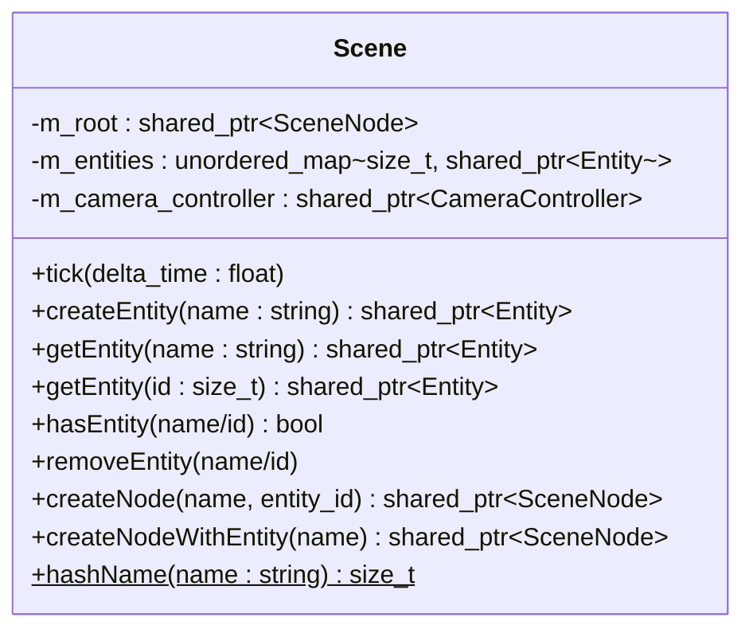
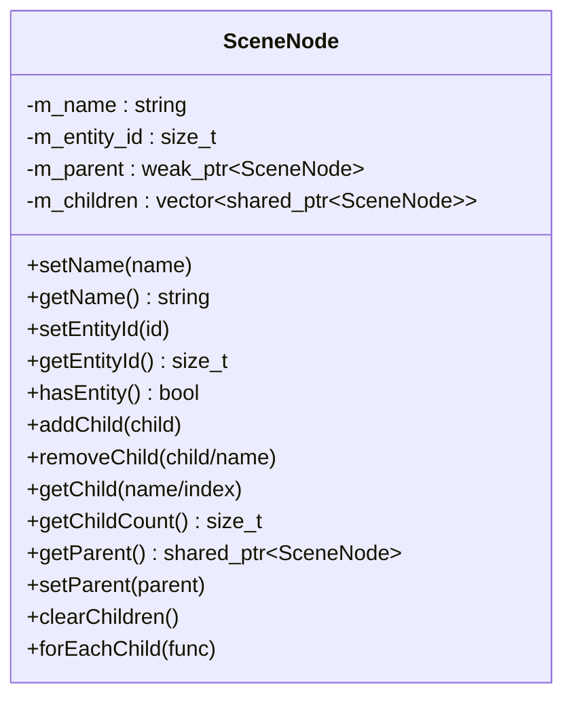
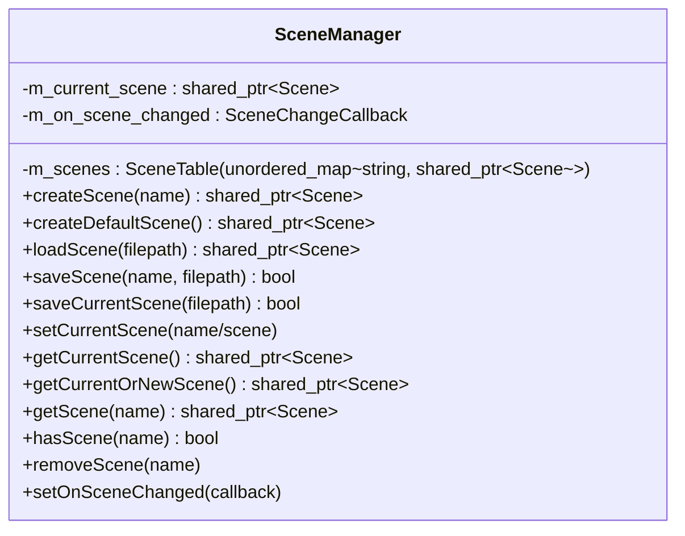
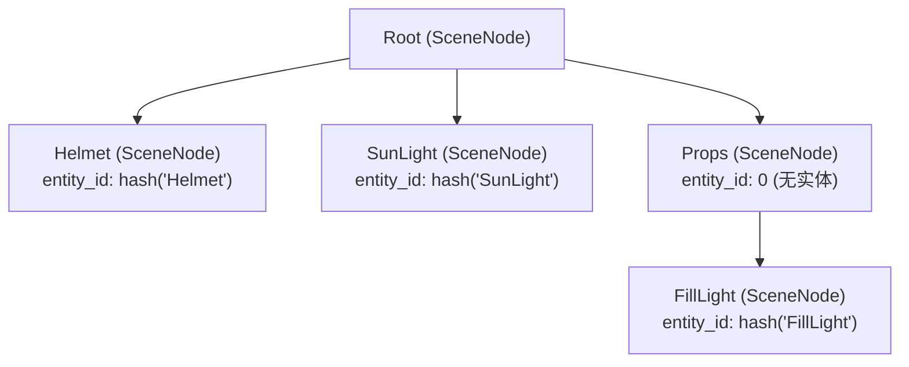
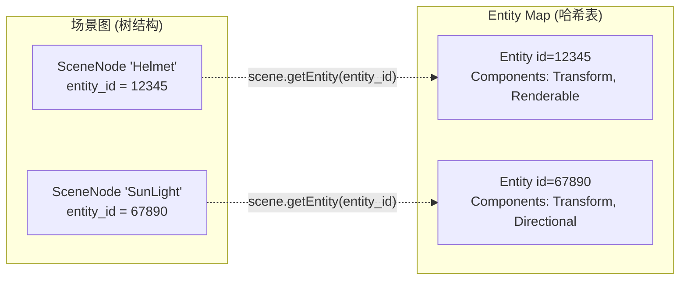
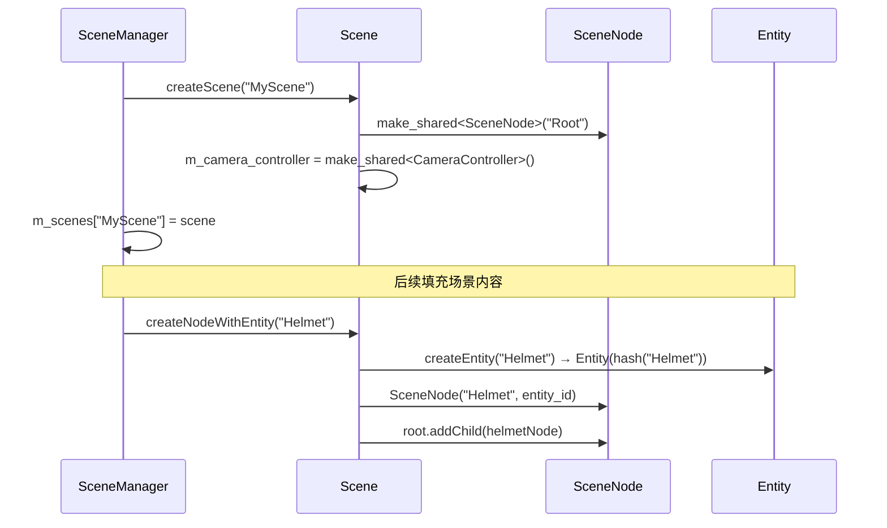
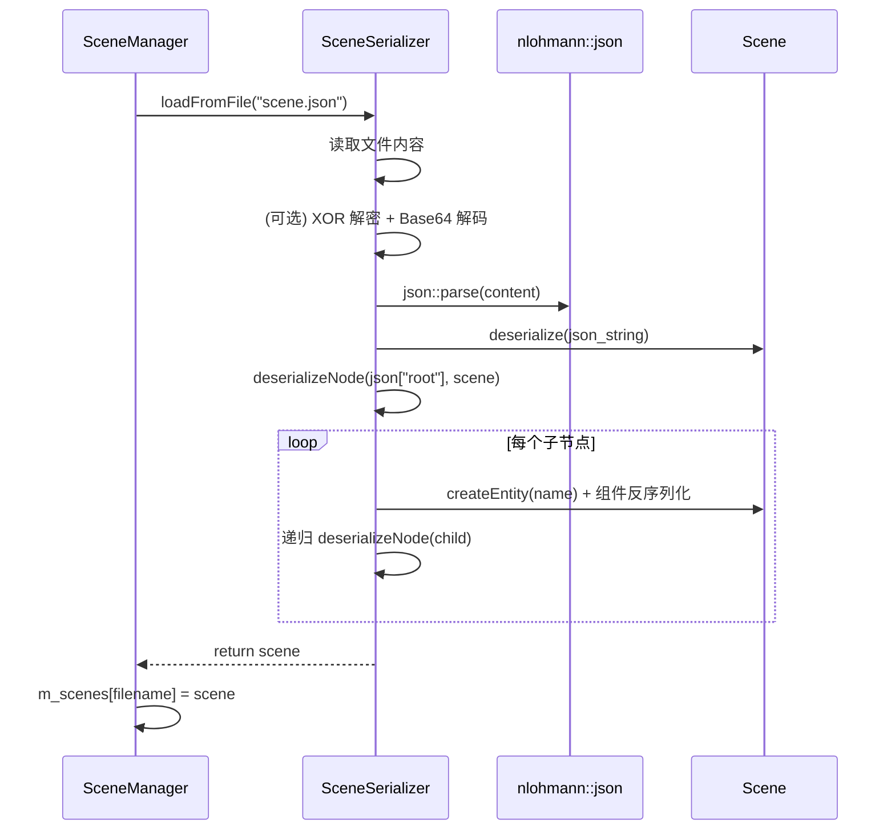
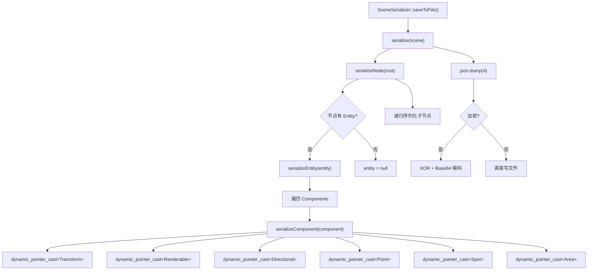

# 场景管理模块详细设计文档 (Scene Management)

> **模块路径**: `src/gameplay/scene/`  
> **核心文件**: `scene.h/cpp`、`scene_node.h/cpp`、`scene_manager.h/cpp`、`scene_serializer.h/cpp`  
> **面试关键词**: Scene Graph、Tree Hierarchy、JSON Serialization、Observer Pattern

---

## 目录

1. [模块概述](#1-模块概述)
2. [核心类详解](#2-核心类详解)
3. [场景图数据结构](#3-场景图数据结构)
4. [场景生命周期](#4-场景生命周期)
5. [场景序列化与反序列化](#5-场景序列化与反序列化)
6. [设计亮点与面试要点](#6-设计亮点与面试要点)

---

## 1. 模块概述

场景管理模块负责管理游戏世界中所有对象的逻辑组织关系。它采用 **Scene Graph（场景图）** 模式，通过树形层级结构管理场景中的节点和实体，并提供完整的场景创建、加载、保存、切换能力。

### 模块文件清单

| 文件 | 行数 | 职责 |
|------|------|------|
| `scene.h/cpp` | ~130 | Scene 容器：根节点 + Entity Map + CameraController |
| `scene_node.h/cpp` | ~170 | SceneNode 树节点：名称 + Entity ID + 父子关系 |
| `scene_manager.h/cpp` | ~280 | 场景管理器：多场景管理、加载/保存、切换通知 |
| `scene_serializer.h/cpp` | ~470 | JSON 序列化/反序列化 + 可选加密 |

---

## 2. 核心类详解

### 2.1 Scene



**核心设计**：

- **Entity 存储**：以 `std::hash<std::string>(name)` 为 Key 存储在 `unordered_map` 中，支持 O(1) 查找。
- **Entity 创建唯一性**：`createEntity()` 先检查是否已存在同名 Entity，避免重复创建。
- **便捷方法**：`createNodeWithEntity()` 一步完成「创建 Entity + 创建 SceneNode + 关联 ID」。
- **逻辑更新**：`tick()` 仅驱动 `CameraController::update()`，其他组件逻辑通过渲染同步间接触发。

### 2.2 SceneNode



**关键设计决策**：

| 设计点 | 实现 | 理由 |
|--------|------|------|
| 父节点引用 | `weak_ptr` | 避免循环引用导致内存泄漏 |
| 子节点存储 | `vector<shared_ptr>` | 保持插入顺序，便于遍历 |
| 自引用管理 | `enable_shared_from_this` | 安全地在成员函数中获取 `shared_ptr<SceneNode>` |
| Entity 关联 | `size_t m_entity_id` | 松耦合：节点不直接持有 Entity，通过 ID 查询 |

**addChild 流程**：

```cpp
void SceneNode::addChild(shared_ptr<SceneNode> child) {
    child->updateParentReference(shared_from_this());  // 设置 weak_ptr parent
    m_children.push_back(child);
}
```

### 2.3 SceneManager



**核心功能**：

- **多场景管理**：通过 `m_scenes` (name → Scene) 管理多个场景实例
- **当前场景**：`m_current_scene` 指向活跃场景
- **场景切换通知**：`setOnSceneChanged(callback)` 注册回调，切换时通知观察者（如 Editor）
- **默认场景**：`createDefaultScene()` 创建一个包含 DamagedHelmet + 方向光的演示场景
- **惰性创建**：`getCurrentOrNewScene()` 如果当前无场景则自动创建默认场景

---

## 3. 场景图数据结构

### 3.1 树形结构示例



### 3.2 Node 与 Entity 的关系



**设计哲学**：
- SceneNode 负责 **层级关系**（父子、遍历）
- Entity 负责 **数据存储**（组件集合）
- 二者通过 `entity_id` 松耦合关联
- 一个 SceneNode 可以没有 Entity（纯组织节点，如文件夹）

---

## 4. 场景生命周期

### 4.1 场景创建



### 4.2 场景加载



### 4.3 场景切换

```cpp
void SceneManager::setCurrentScene(shared_ptr<Scene> scene) {
    auto old_scene = m_current_scene;
    m_current_scene = scene;
    if (m_on_scene_changed)
        m_on_scene_changed(old_scene, m_current_scene);  // 通知观察者
}
```

---

## 5. 场景序列化与反序列化

### 5.1 JSON 格式

```json
{
  "root": {
    "name": "Root",
    "entity": null,
    "children": [
      {
        "name": "Helmet",
        "entity": {
          "name": "Helmet",
          "components": [
            {
              "type": "Transform",
              "position": [0.0, 0.0, 0.0],
              "rotation": [0.0, 0.0, 0.0, 1.0],
              "scale": [1.0, 1.0, 1.0]
            },
            {
              "type": "Renderable",
              "model_path": "assets/helmet/DamagedHelmet.gltf"
            }
          ]
        },
        "children": []
      },
      {
        "name": "SunLight",
        "entity": {
          "name": "SunLight",
          "components": [
            {
              "type": "Transform",
              "position": [0.0, 5.0, -5.0],
              "rotation": [0.0, 0.0, 0.0, 1.0],
              "scale": [1.0, 1.0, 1.0]
            },
            {
              "type": "Directional",
              "color": [1.0, 1.0, 1.0],
              "intensity": 1.0,
              "enabled": true
            }
          ]
        },
        "children": []
      }
    ]
  }
}
```

### 5.2 序列化流程



### 5.3 组件序列化映射

| 组件类型 | JSON "type" 字段 | 序列化字段 |
|---------|-----------------|-----------|
| Transform | `"Transform"` | position[3], rotation[4], scale[3] |
| Renderable | `"Renderable"` | model_path |
| Directional | `"Directional"` | color[3], intensity, enabled |
| Point | `"Point"` | color[3], intensity, enabled, constant, linear, quadratic, range |
| Spot | `"Spot"` | color[3], intensity, enabled, constant, linear, quadratic, range, inner_cone_angle, outer_cone_angle |
| Area | `"Area"` | color[3], intensity, enabled, width, height |

### 5.4 可选加密机制

序列化支持可选的 XOR + Base64 加密：

```
明文 JSON → XOR(key) → Base64 编码 → 写入文件
读取文件 → Base64 解码 → XOR(key) → 明文 JSON
```

加密密钥定义在 `utils.h` 中，使用编译时字符串混淆。

---

## 6. 设计亮点与面试要点

### 架构设计亮点

1. **Scene Graph + Entity Map 双重索引**：层级关系通过 SceneNode 树维护，数据通过 Entity 哈希表存储，兼顾遍历效率和随机访问效率。

2. **松耦合关联**：SceneNode 仅存储 `entity_id` 而非直接引用 Entity，降低了耦合度，支持无实体的纯组织节点。

3. **Observer 模式**：`SceneManager::setOnSceneChanged()` 提供场景切换通知机制，Editor 模块通过注册回调响应场景变化。

4. **递归序列化**：SceneSerializer 的递归设计自然匹配树形结构，代码简洁且可扩展。

### 面试高频问题

**Q: 为什么 Entity 的 Key 使用名称哈希而不是自增 ID？**

A: 使用 `std::hash<string>(name)` 使得 Entity 可以通过名称直接查找（O(1)），同时哈希值在序列化/反序列化后保持一致，不依赖运行时分配顺序。缺点是存在哈希碰撞风险，但在游戏引擎的场景规模下概率极低。

**Q: SceneNode 的父节点为什么用 weak_ptr？**

A: 父子关系中，父节点持有子节点的 `shared_ptr`（所有权），子节点持有父节点的 `weak_ptr`（观察引用），打破了循环引用。如果都用 `shared_ptr` 会导致引用计数永远不为零，内存泄漏。

**Q: 场景序列化如何处理组件的多态性？**

A: 反序列化时通过 JSON 的 `"type"` 字段识别组件类型，使用 `if-else` 链分发到具体的构造逻辑。序列化时通过 `dynamic_pointer_cast` 逐一尝试转换。这是一种简单直接的方案，适合组件类型有限的场景。更复杂的引擎可能会使用反射系统或类型注册表。

---

> **模块总结**：场景管理模块通过 Scene Graph + Entity Map 的双重索引设计，实现了高效的层级遍历和随机访问。JSON 序列化提供了人类可读的持久化方案，Observer 模式确保了模块间的松耦合通信。
