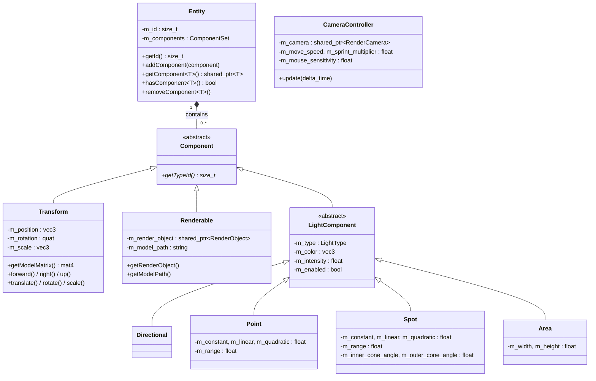
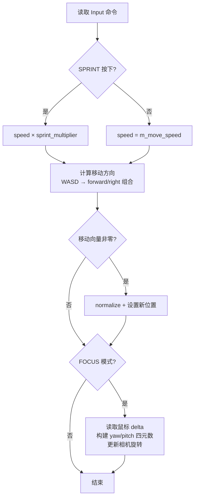
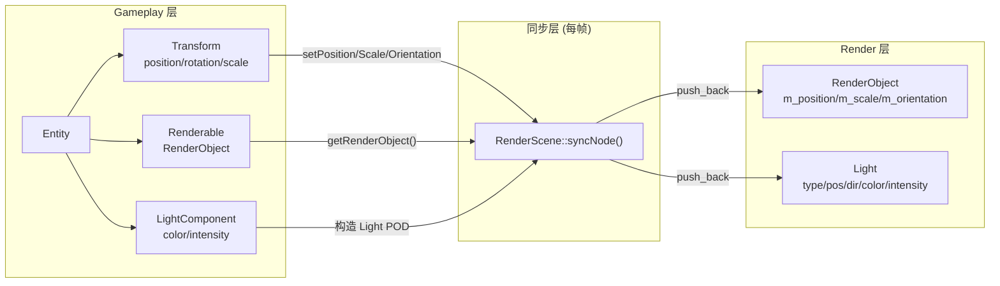

# 实体组件系统详细设计文档 (Entity-Component System)

> **模块路径**: `src/gameplay/entity.*`、`src/gameplay/component.*`、`src/gameplay/components/`  
> **核心文件**: `entity.h/cpp`、`component.h/cpp`、`transform.h/cpp`、`renderable.h/cpp`、`camera_controller.h/cpp`、`lighting/*.h/cpp`  
> **面试关键词**: EC Pattern、Type Erasure、RTTI、Component-Based Architecture

---

## 目录

1. [模块概述](#1-模块概述)
2. [架构设计](#2-架构设计)
3. [核心类详解](#3-核心类详解)
4. [组件类型详解](#4-组件类型详解)
5. [类型系统实现](#5-类型系统实现)
6. [与渲染层的数据桥接](#6-与渲染层的数据桥接)
7. [设计亮点与面试要点](#7-设计亮点与面试要点)

---

## 1. 模块概述

RealmEngine 采用 **Entity-Component (EC)** 架构，而非完整的 Entity-Component-System (ECS)。其核心理念是：

- **Entity** 是一个纯粹的组件容器，本身不包含任何逻辑
- **Component** 是数据载体，通过继承实现多态
- **没有独立的 System 层**——逻辑分散在 `Scene::tick()`、`RenderScene::syncNode()`、`Renderer::render()` 等处

### 与标准 ECS 的对比

| 特性 | RealmEngine EC | 标准 ECS (如 EnTT) |
|------|---------------|-------------------|
| 数据存储 | Entity 持有 Component Map | Archetype/Sparse Set 连续存储 |
| 类型标识 | `std::type_index::hash_code()` | 编译时类型 ID / 模板元编程 |
| System | 无独立 System，逻辑散布 | 独立 System 注册与调度 |
| 缓存友好性 | 较差（指针间接访问） | 优秀（连续内存布局） |
| 灵活性 | 运行时动态增删组件 | 运行时动态增删组件 |
| 复杂度 | 低，易于理解 | 高，需要理解 Archetype 等概念 |

---

## 2. 架构设计

### 2.1 整体架构图



> **注**：`CameraController` 不继承自 `Component`，而是直接由 `Scene` 持有，控制渲染相机。

### 2.2 ComponentSet 内部结构

```
Entity m_components (unordered_map<size_t, shared_ptr<Component>>)
┌────────────────────────────────────────────────────────┐
│ Key (type_index hash)    │ Value (shared_ptr<Component>)  │
├──────────────────────────┼────────────────────────────────┤
│ hash(typeid(Transform))  │ → Transform { pos, rot, scale }│
│ hash(typeid(Renderable)) │ → Renderable { render_object } │
│ hash(typeid(Point))      │ → Point { color, intensity... }│
└──────────────────────────┴────────────────────────────────┘
```

**每个 Entity 最多持有同类型组件 1 个**（Map 的 Key 唯一性保证）。

---

## 3. 核心类详解

### 3.1 Component（抽象基类）

```cpp
class Component {
public:
    Component() = default;
    virtual ~Component() noexcept = 0;  // 纯虚析构 → 抽象类
    
    Component(const Component&) = delete;      // 不可拷贝
    Component(Component&&) noexcept = default;  // 可移动
    
    virtual size_t getTypeId() const = 0;  // 纯虚：返回类型标识
};
```

**设计要点**：
- 纯虚析构函数使 `Component` 成为抽象类，不可实例化
- 析构函数在 `.cpp` 中定义 `= default`（分离编译，避免链接问题）
- 禁止拷贝，允许移动

### 3.2 Entity

```cpp
class Entity {
    using ComponentSet = std::unordered_map<size_t, std::shared_ptr<Component>>;
    
    size_t m_id;
    ComponentSet m_components;
    
    // 非模板接口（通过 type_id）
    void addComponent(shared_ptr<Component> component);
    shared_ptr<Component> getComponent(size_t type_id);
    bool hasComponent(size_t type_id) const;
    void removeComponent(size_t type_id);
    
    // 模板便捷接口
    template<typename T> shared_ptr<T> getComponent();
    template<typename T> bool hasComponent() const;
    template<typename T> void removeComponent();
};
```

**addComponent 实现**：

```cpp
void Entity::addComponent(shared_ptr<Component> component) {
    if (!component) return;
    size_t type_id = component->getTypeId();
    m_components[type_id] = component;  // 自动覆盖同类型旧组件
}
```

**getComponent<T> 模板实现**：

```cpp
template<typename T>
shared_ptr<T> Entity::getComponent() {
    size_t type_id = std::type_index(typeid(T)).hash_code();
    auto comp = getComponent(type_id);
    if (comp) return std::dynamic_pointer_cast<T>(comp);
    return nullptr;
}
```

---

## 4. 组件类型详解

### 4.1 Transform 组件

**职责**：存储和操作空间变换（位置、旋转、缩放）。

```cpp
class Transform : public Component {
    glm::vec3 m_position;   // 世界坐标位置
    glm::quat m_rotation;   // 四元数旋转（避免万向锁）
    glm::vec3 m_scale;      // 缩放因子
};
```

**Model 矩阵构建**：

```cpp
glm::mat4 Transform::getModelMatrix() const {
    glm::mat4 model = glm::mat4(1.0f);
    model = glm::scale(model, m_scale);              // S
    model = glm::mat4_cast(m_rotation) * model;      // R × S
    model = glm::translate(model, m_position);        // T × R × S
    return model;
}
```

矩阵顺序：**T × R × S**（标准变换顺序，先缩放 → 旋转 → 平移）。

**方向向量**：

```cpp
vec3 getForward() { return m_rotation * vec3(0, 0, -1); }  // OpenGL 惯例：-Z 为前方
vec3 getRight()   { return m_rotation * vec3(1, 0, 0);  }
vec3 getUp()      { return m_rotation * vec3(0, 1, 0);  }
```

**API 设计**：
- `setPosition(vec3)` / `setPosition(x, y, z)` — 绝对设置
- `translate(vec3)` / `translate(x, y, z)` — 相对偏移
- `setRotation(quat)` / `setRotation(euler)` — 绝对旋转
- `rotate(quat)` / `rotate(axis, angle)` — 增量旋转
- `setScale(vec3)` / `setScale(uniform)` — 绝对缩放
- `scale(vec3)` / `scale(uniform)` — 增量缩放
- `reset()` — 重置为原点/单位

### 4.2 Renderable 组件

**职责**：将 Entity 与可渲染的 3D 模型关联。

```cpp
class Renderable : public Component {
    shared_ptr<RenderObject> m_render_object;  // 渲染对象
    string m_model_path;                        // 模型文件路径
    
    // 构造方式：
    Renderable();                                 // 空 Renderable
    Renderable(shared_ptr<RenderObject> obj);     // 已有 RenderObject
    Renderable(const string& model_path);         // 从路径加载
    Renderable(const string& path, bool flip_uv); // 可选翻转 UV
};
```

**加载时机**：Renderable 在构造时即触发 Assimp 模型加载。这意味着：
- 序列化恢复时，反序列化 `Renderable` 会立即加载模型到 GPU
- 运行时动态创建也会触发即时加载

### 4.3 LightComponent 系列

**继承层次**：

```
LightComponent (abstract)
├── Directional  — 方向光（无位置衰减，仅方向）
├── Point        — 点光源（位置 + 衰减 + 范围）
├── Spot         — 聚光灯（位置 + 衰减 + 范围 + 锥角）
└── Area         — 面光源（位置 + 宽高）
```

**基类属性**：

| 属性 | 类型 | 默认值 | 说明 |
|------|------|--------|------|
| `m_type` | `LightType` | 由子类设置 | 枚举类型标识 |
| `m_color` | `glm::vec3` | `(1, 1, 1)` | 光源颜色 |
| `m_intensity` | `float` | `1.0` | 光源强度 |
| `m_enabled` | `bool` | `true` | 是否启用 |

**Point 光源默认衰减**：

| 参数 | 默认值 | 公式中对应项 |
|------|--------|-------------|
| `m_constant` | 1.0 | 衰减公式分母常数项 |
| `m_linear` | 0.09 | 线性衰减系数 |
| `m_quadratic` | 0.032 | 二次衰减系数 |
| `m_range` | 50.0 | 最大影响范围 |

衰减公式：`attenuation = 1.0 / (constant + linear × d + quadratic × d²)`

**Spot 光源锥角**：

| 参数 | 默认值 | 说明 |
|------|--------|------|
| `m_inner_cone_angle` | 12.5° | 内锥角（全亮区域） |
| `m_outer_cone_angle` | 17.5° | 外锥角（过渡到无光） |

### 4.4 CameraController

```cpp
class CameraController {
    shared_ptr<RenderCamera> m_camera;       // 控制的渲染相机
    float m_move_speed = 5.0f;               // 移动速度
    float m_sprint_multiplier = 2.0f;        // 冲刺倍率
    float m_mouse_sensitivity = 0.1f;        // 鼠标灵敏度
    
    void update(float delta_time);  // 每帧更新
};
```

**update 逻辑**：



**旋转计算**：
```cpp
// Yaw：绕世界 Y 轴旋转（水平转向）
glm::quat yaw = glm::angleAxis(radians(-yaw_delta), vec3(0, 1, 0));
// Pitch：绕相机局部 X 轴旋转（上下仰俯）
glm::quat pitch = glm::angleAxis(radians(-pitch_delta), vec3(1, 0, 0));
// 组合：Yaw × Current × Pitch（左乘全局，右乘局部）
new_rotation = yaw * current * pitch;
```

---

## 5. 类型系统实现

### 5.1 类型 ID 生成

每个 Component 子类通过 `getTypeId()` 返回唯一标识：

```cpp
size_t Transform::getTypeId() const {
    return std::type_index(typeid(Transform)).hash_code();
}
```

**机制分析**：
- `typeid(T)` — C++ RTTI，返回 `std::type_info` 引用
- `std::type_index(type_info)` — 可哈希包装
- `.hash_code()` — 返回 `size_t` 哈希值

**优点**：简单直接，无需手动分配 ID
**缺点**：依赖 RTTI（部分嵌入式环境不可用），`hash_code()` 在极少数情况下可能碰撞

### 5.2 模板方法中的类型匹配

```cpp
template<typename T>
shared_ptr<T> Entity::getComponent() {
    size_t type_id = std::type_index(typeid(T)).hash_code();  // 编译时类型 → 运行时 hash
    auto comp = getComponent(type_id);                         // 查找
    return std::dynamic_pointer_cast<T>(comp);                 // 安全向下转型
}
```

**调用示例**：

```cpp
auto transform = entity->getComponent<Transform>();
if (transform) {
    glm::vec3 pos = transform->getPosition();
}
```

---

## 6. 与渲染层的数据桥接

EC 系统中的数据如何流向渲染层：



**关键同步代码（RenderScene::syncNode 核心逻辑）**：

```cpp
// 1. 读取 Transform
auto transform = entity->getComponent<Transform>();
glm::vec3 position = transform ? transform->getPosition() : glm::vec3(0);
glm::quat rotation = transform ? transform->getRotation() : glm::quat(1,0,0,0);
glm::vec3 scale    = transform ? transform->getScale()    : glm::vec3(1);

// 2. 同步 Renderable → RenderObject
auto renderable = entity->getComponent<Renderable>();
if (renderable && renderable->hasRenderObject()) {
    auto ro = renderable->getRenderObject();
    ro->setPosition(position);
    ro->setOrientation(rotation);
    ro->setScale(scale);
    m_render_objects.push_back(ro);
}

// 3. 同步 LightComponent → Light POD
auto point = entity->getComponent<Point>();
if (point && point->isEnabled()) {
    Light light;
    light.type = LightType::Point;
    light.position = position;
    light.color = point->getColor();
    light.intensity = point->getIntensity();
    // ... 衰减参数
    m_lights.push_back(light);
}
```

---

## 7. 设计亮点与面试要点

### 面试高频问题

**Q: 为什么不使用完整的 ECS 架构？**

A: 这是一个有意的权衡。完整 ECS（如 Archetype 模式）虽然缓存友好、适合大规模场景，但实现复杂度高。RealmEngine 的场景规模适中（几十到几百个实体），EC 模式足够高效且代码可读性更好。后续需要优化时可以逐步迁移到 ECS。

**Q: 为什么 CameraController 不继承 Component？**

A: CameraController 是全局唯一的，且直接操作 `RenderCamera`（渲染层对象），与其他 Component 的数据存储性质不同。将它作为 Scene 的直接成员更清晰：每个 Scene 有且仅有一个相机控制器。

**Q: 组件的 addComponent 如何处理同类型组件？**

A: `m_components[type_id] = component` 直接覆盖同类型旧组件。这是有意设计——每个 Entity 同类型组件最多一个。如果需要多个同类型组件（如多个碰撞体），需要扩展设计（如使用列表或数组）。

**Q: dynamic_pointer_cast 的性能开销？**

A: `dynamic_pointer_cast` 内部使用 `dynamic_cast` + 引用计数操作。在组件查询频繁的场景中可能有开销。优化方案：
1. 缓存查询结果，避免每帧重复查询
2. 使用 `static_pointer_cast`（前提是类型已确认）
3. 使用 Component 基类的 `getTypeId()` 进行快速预检查

---

> **模块总结**：EC 系统以简洁的设计实现了灵活的组件化对象模型。通过 RTTI + unordered_map 实现运行时类型系统，通过 RenderScene 同步机制实现 Gameplay/Render 层解耦。适合中小规模场景的快速开发。
