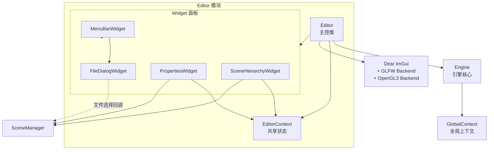
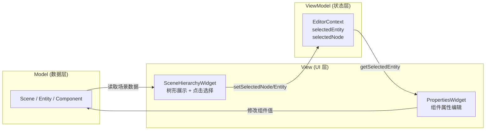
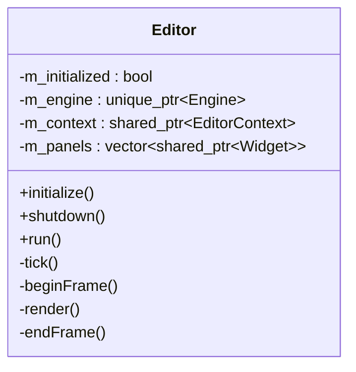
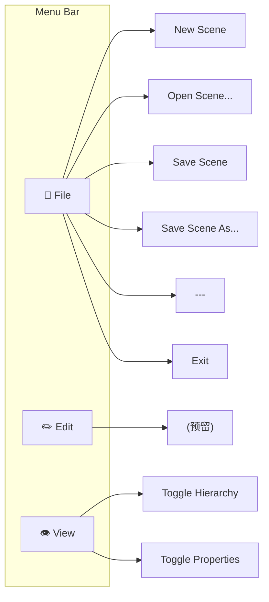
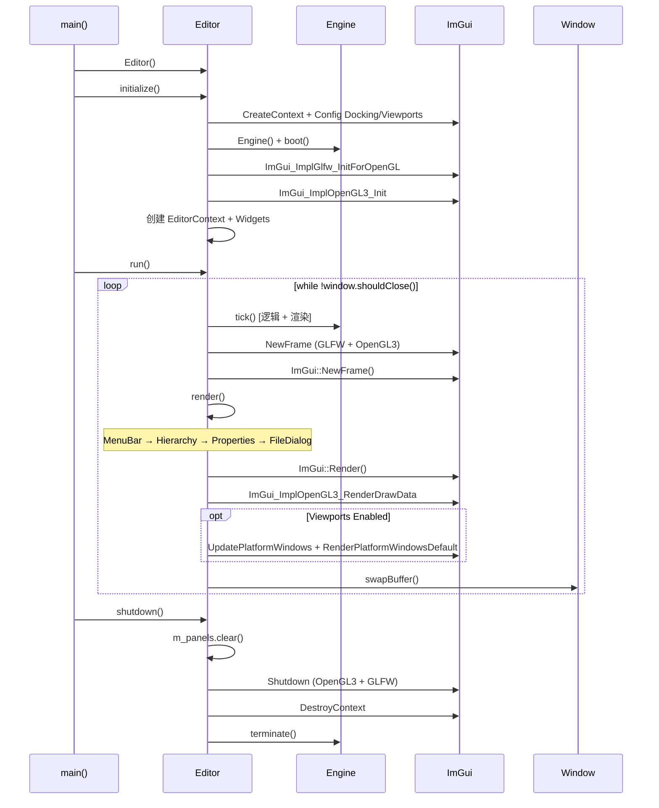

# 编辑器模块详细设计文档 (Editor Module)

> **模块路径**: `src/editor/`  
> **核心文件**: `editor.h/cpp`、`editor_context.h/cpp`、`widget.h`、`widgets/*.h/cpp`  
> **面试关键词**: ImGui、Docking、Immediate Mode GUI、Widget Architecture、MVVM-like

---

## 目录

1. [模块概述](#1-模块概述)
2. [架构设计](#2-架构设计)
3. [核心类详解](#3-核心类详解)
4. [Widget 系统](#4-widget-系统)
5. [Editor 生命周期](#5-editor-生命周期)
6. [ImGui 集成细节](#6-imgui-集成细节)
7. [设计亮点与面试要点](#7-设计亮点与面试要点)

---

## 1. 模块概述

Editor 模块为 RealmEngine 提供基于 **Dear ImGui** 的可视化编辑器界面。它构建在 Engine 之上，在每帧的引擎渲染之后叠加 ImGui UI 层。编辑器支持：

- ImGui Docking 布局（多面板自由拖拽、停靠）
- 场景层次结构浏览与节点选择
- 选中实体的属性编辑（Transform、Renderable、各类 Light）
- 文件操作（新建/打开/保存场景）

### 模块文件清单

| 文件 | 行数 | 职责 |
|------|------|------|
| `editor.h/cpp` | ~225 | 编辑器主控：ImGui 初始化、Widget 管理、帧循环 |
| `editor_context.h/cpp` | ~60 | 编辑器上下文：选中状态共享 |
| `widget.h` | ~30 | Widget 抽象基类 |
| `widgets/menu_bar_widget.h/cpp` | ~210 | 菜单栏：File/Edit/View |
| `widgets/scene_hierarchy_widget.h/cpp` | ~120 | 场景层次面板 |
| `widgets/properties_widget.h/cpp` | ~325 | 属性编辑面板 |
| `widgets/file_dialog_widget.h/cpp` | ~290 | 文件对话框 |

---

## 2. 架构设计

### 2.1 模块关系图



### 2.2 数据流模型

编辑器采用类 **MVVM** 的数据流模式：



---

## 3. 核心类详解

### 3.1 Editor

Editor 是编辑器的顶层控制器，负责：
- 持有并管理 `Engine` 实例
- 初始化 ImGui 及其 GLFW/OpenGL 后端
- 管理 Widget 面板列表
- 驱动编辑器帧循环



**initialize() 关键步骤**：

```
1. IMGUI_CHECKVERSION()
2. ImGui::CreateContext()
3. 配置 ImGuiIO:
   - NavEnableKeyboard
   - DockingEnable      ← 启用 Docking
   - ViewportsEnable    ← 启用多视口（可拖出独立窗口）
4. ImGui::StyleColorsDark()
5. 创建 Engine 并 boot()
6. ImGui_ImplGlfw_InitForOpenGL(window, true)
7. ImGui_ImplOpenGL3_Init("#version 330")
8. 创建 EditorContext
9. 创建并配置 Widget 面板
```

**tick() 帧循环**：

```
Editor::tick()
├── m_engine->tick()         ← 引擎逻辑 + 渲染
├── beginFrame()             ← ImGui NewFrame
├── render()                 ← 各 Widget::render()
├── endFrame()               ← ImGui::Render() + 交换缓冲
└── window->swapBuffer()
```

### 3.2 EditorContext

EditorContext 是 Widget 间共享状态的桥梁：

```cpp
class EditorContext {
    shared_ptr<Entity>    m_selected_entity;  // 当前选中实体
    shared_ptr<SceneNode> m_selected_node;    // 当前选中节点
    
    // Getter/Setter/Has/Clear 全套接口
};
```

**设计要点**：
- 使用 `shared_ptr` 传递给多个 Widget，确保状态共享
- `SceneHierarchyWidget` 负责 **写入** 选中状态
- `PropertiesWidget` 负责 **读取** 选中状态并展示编辑 UI

---

## 4. Widget 系统

### 4.1 Widget 基类

```cpp
class Widget {
    string m_name;
    bool   m_open;       // 面板是否打开
    
    virtual void render() = 0;  // 纯虚：绘制 UI
    
    string getName();
    bool   isOpen();
    void   setOpen(bool);
};
```

### 4.2 MenuBarWidget

**职责**：顶部菜单栏，提供文件操作和面板可见性控制。



**关键实现**：
- 持有所有 Widget 的引用（`shared_ptr<vector<shared_ptr<Widget>>>`），用于 View 菜单控制可见性
- 持有 `FileDialogWidget` 引用，用于打开/保存文件操作
- 新建场景：`SceneManager::createDefaultScene()` + `setCurrentScene()`

### 4.3 SceneHierarchyWidget

**职责**：展示场景节点的树形层次结构，支持节点选择。

```cpp
class SceneHierarchyWidget : public Widget {
    shared_ptr<EditorContext> m_context;
    
    void render() override;
    void renderNode(shared_ptr<SceneNode> node);  // 递归绘制节点树
};
```

**renderNode 逻辑**：

```
renderNode(node)
├── 计算 ImGuiTreeNodeFlags：
│   ├── 有子节点 → DefaultOpen
│   └── 无子节点 → Leaf | NoTreePushOnOpen
│   └── 是选中节点 → Selected
├── ImGui::TreeNodeEx(node_name, flags)
├── 如果点击 → 更新 EditorContext 的选中状态：
│   ├── setSelectedNode(node)
│   └── 如果节点有 Entity → setSelectedEntity(entity)
│   └── 否则 → clearSelectedEntity()
└── 递归 renderNode(child) for each child
```

### 4.4 PropertiesWidget

**职责**：编辑选中实体的各类组件属性。

```cpp
class PropertiesWidget : public Widget {
    shared_ptr<EditorContext> m_context;
    
    void render() override;
    void renderTransform();           // 编辑 Position/Rotation/Scale
    void renderRenderable();          // 显示模型路径
    void renderPointLight();          // 编辑 Point 属性
    void renderSpotLight();           // 编辑 Spot 属性
    void renderDirectionalLight();    // 编辑 Directional 属性
    void renderAreaLight();           // 编辑 Area 属性
};
```

**render() 逻辑**：

```
render()
├── 检查 EditorContext 是否有选中实体
├── 显示实体名称
├── if hasComponent<Transform> → renderTransform()
│   ├── ImGui::DragFloat3("Position", ...)
│   ├── ImGui::DragFloat3("Rotation (Euler)", ...)
│   └── ImGui::DragFloat3("Scale", ...)
├── if hasComponent<Renderable> → renderRenderable()
│   └── ImGui::Text("Model: %s", model_path)
├── if hasComponent<Point> → renderPointLight()
│   ├── ImGui::ColorEdit3("Color", ...)
│   ├── ImGui::DragFloat("Intensity", ...)
│   ├── ImGui::DragFloat("Range", ...)
│   └── ImGui::DragFloat("Constant/Linear/Quadratic", ...)
├── ... 其他灯光类型类似
```

### 4.5 FileDialogWidget

**职责**：文件浏览与选择对话框。

```cpp
class FileDialogWidget : public Widget {
    enum class Mode { Open, Save };
    
    Mode m_mode;
    filesystem::path m_current_path;     // 当前浏览目录
    filesystem::path m_selected_path;    // 选中文件路径
    vector<filesystem::path> m_current_directory_entries;
    char m_filename_buffer[256];          // 文件名输入缓冲
    OnFileSelectedCallback m_callback;    // 选择完成回调
    
    void open(Mode, title, filter, initial_path);
    void close();
    void render() override;
};
```

**回调机制**：

```cpp
// Editor::initialize() 中注册回调
file_dialog->setOnFileSelected([file_dialog](const path& p) {
    if (file_dialog->getMode() == Mode::Open) {
        auto scene = g_context.m_scene->loadScene(p.string());
        g_context.m_scene->setCurrentScene(scene);
    } else {
        g_context.m_scene->saveCurrentScene(p.string());
    }
});
```

---

## 5. Editor 生命周期



---

## 6. ImGui 集成细节

### 6.1 技术选型

| 组件 | 选择 | 说明 |
|------|------|------|
| ImGui 版本 | Docking 分支 | 支持面板停靠 |
| 平台后端 | `imgui_impl_glfw` | GLFW 窗口/输入适配 |
| 渲染后端 | `imgui_impl_opengl3` | OpenGL 3.3 渲染 |
| GLSL 版本 | `#version 330` | 匹配 OpenGL 3.3 Core Profile |

### 6.2 ImGui 配置标志

```cpp
io.ConfigFlags |= ImGuiConfigFlags_NavEnableKeyboard;  // 键盘导航
io.ConfigFlags |= ImGuiConfigFlags_DockingEnable;       // Docking 支持
io.ConfigFlags |= ImGuiConfigFlags_ViewportsEnable;     // 多视口
```

### 6.3 渲染集成位置

```
一帧的渲染流程：
├── Engine::logicalTick()     ← 输入/逻辑
├── Engine::renderTick()      ← 3D 场景渲染（到 FBO → 屏幕）
├── ImGui::NewFrame()         ← 开始 ImGui 帧
├── Widget::render() × N      ← 绘制编辑器 UI
├── ImGui::Render()           ← 生成 ImGui Draw Data
├── ImGui_ImplOpenGL3_RenderDrawData()  ← 叠加到屏幕
└── Window::swapBuffer()      ← 显示
```

ImGui 的渲染是 **叠加在** 3D 场景之上的，先渲染 3D 再渲染 UI。

---

## 7. 设计亮点与面试要点

### 架构设计亮点

1. **Widget 抽象化**：通过 `Widget` 基类统一管理所有面板，支持动态开关、列表遍历渲染。
2. **EditorContext 状态共享**：类似 MVVM 的 ViewModel，解耦了 Hierarchy（写入选择）和 Properties（读取选择）。
3. **回调驱动文件操作**：FileDialogWidget 通过回调将文件选择结果传递给业务逻辑，Widget 本身不依赖具体业务。
4. **编辑器/引擎分离**：Editor 持有 Engine，不修改 Engine 代码；引擎独立运行时不引入 ImGui 依赖。

### 面试高频问题

**Q: 为什么选择 ImGui 而不是 Qt 或其他 GUI 框架？**

A: ImGui 是即时模式 GUI，特别适合游戏引擎编辑器：
- 直接在 OpenGL Context 中渲染，无需额外窗口系统
- API 极其简洁（一行代码 = 一个控件）
- Docking 分支提供专业级面板布局
- 无外部依赖（纯 C++，头文件集成）
- 性能高（直接生成 draw call）

**Q: ImGui 的 Docking 是如何工作的？**

A: ImGui 的 Docking 系统：
1. 启用 `DockingEnable` 标志
2. 内部维护一个 DockSpace（停靠空间）
3. 用户可以拖拽任何 ImGui 窗口到 DockSpace 的边缘或中央
4. 自动分割/合并面板区域
5. 布局信息保存在 `imgui.ini` 中，重启后恢复

**Q: Editor 如何与 Engine 解耦？**

A: Editor 将 Engine 作为 `unique_ptr` 成员，通过以下方式解耦：
- Engine 不知道 Editor 的存在（Engine 代码中无 Editor 引用）
- Editor 的 `tick()` 先调用 `Engine::tick()` 处理逻辑和渲染，再叠加 ImGui
- Debug 模式下可以完全绕过 Editor 直接运行 Engine
- ImGui 相关代码全部限制在 `editor/` 目录内

---

> **模块总结**：编辑器模块通过 ImGui Docking 实现了专业级的可视化编辑界面。Widget 架构提供了良好的可扩展性，EditorContext 实现了面板间的松耦合状态共享。编辑器与引擎的清晰分离确保了引擎核心逻辑的独立性。
