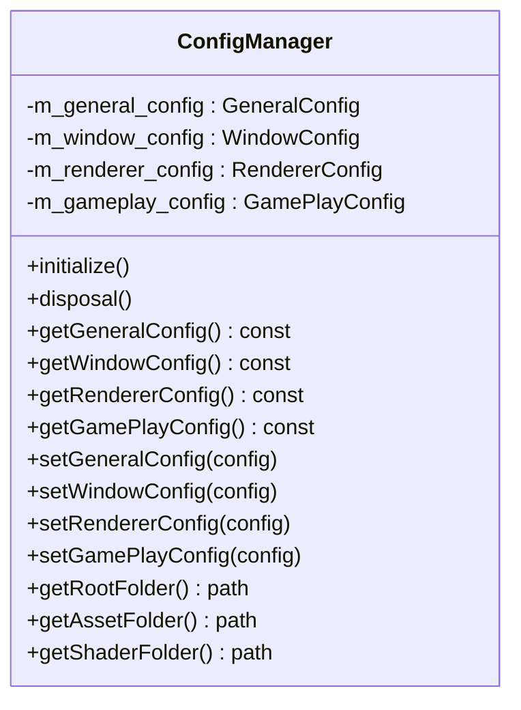
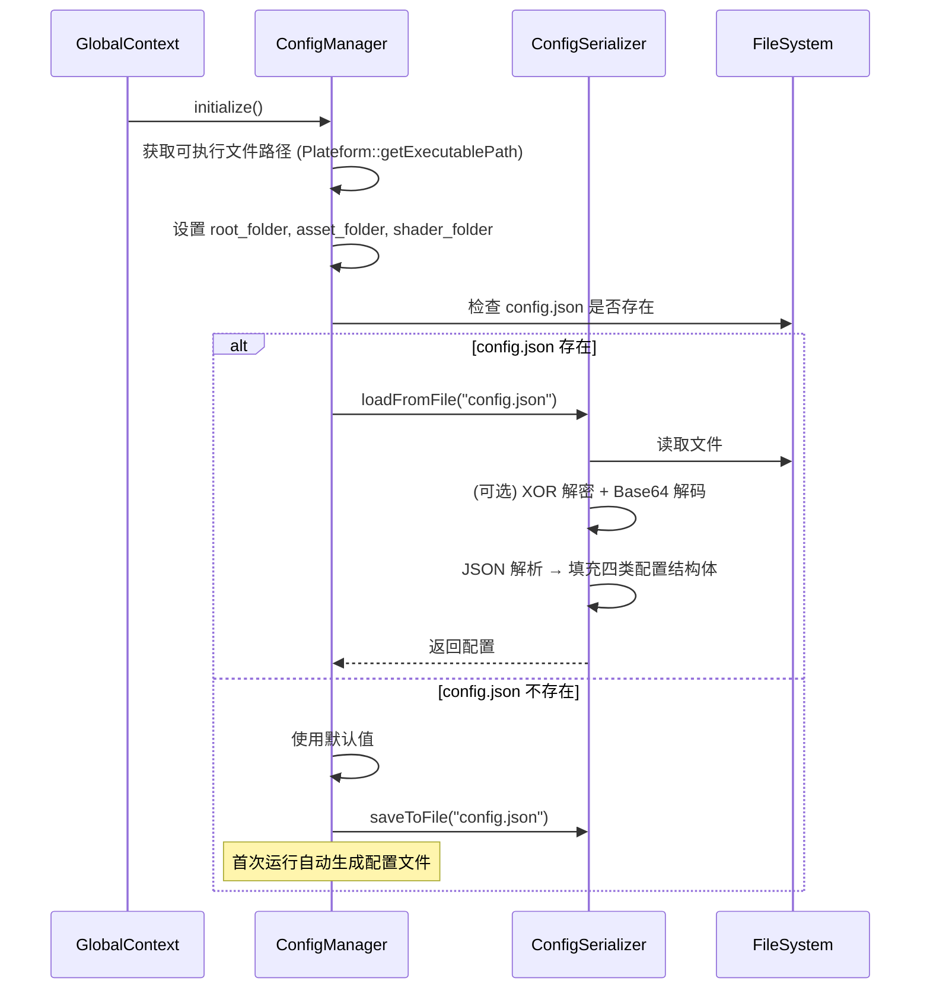
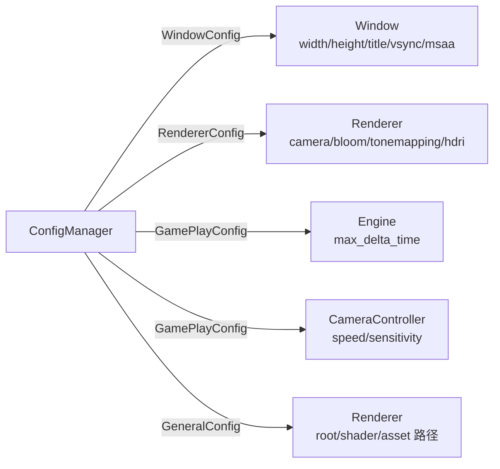
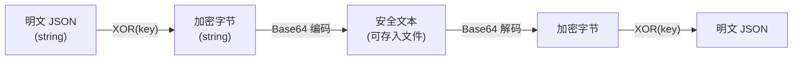

# 资源与配置模块详细设计文档 (Resource & Config Module)

> **模块路径**: `src/resource/`  
> **核心文件**: `config_manager.h/cpp`、`config_serializer.h/cpp`、`asset_manager.h/cpp`  
> **面试关键词**: Configuration Management、JSON Serialization、XOR Encryption、Strategy Pattern

---

## 目录

1. [模块概述](#1-模块概述)
2. [配置管理系统](#2-配置管理系统)
3. [配置序列化器](#3-配置序列化器)
4. [资产管理器](#4-资产管理器)
5. [设计亮点与面试要点](#5-设计亮点与面试要点)

---

## 1. 模块概述

资源与配置模块负责引擎运行时的配置加载/存储和资产管理。目前配置管理系统已完整实现，资产管理器为预留接口（Stub）。

### 模块文件清单

| 文件 | 行数 | 职责 |
|------|------|------|
| `config_manager.h/cpp` | ~170 | 配置管理器：四类配置结构体 + Getter/Setter |
| `config_serializer.h/cpp` | ~320 | 配置序列化：JSON ↔ Config 双向转换 + 可选加密 |
| `asset_manager.h/cpp` | ~20 | 资产管理器（Stub，预留扩展） |

---

## 2. 配置管理系统

### 2.1 ConfigManager



### 2.2 四类配置结构体

#### GeneralConfig — 通用路径配置

```cpp
struct GeneralConfig {
    std::filesystem::path root_folder;    // 引擎根目录
    std::filesystem::path asset_folder;   // 资源目录
    std::filesystem::path shader_folder;  // 着色器目录
};
```

#### WindowConfig — 窗口配置

```cpp
struct WindowConfig {
    int         width        = 1280;        // 窗口宽度
    int         height       = 720;         // 窗口高度
    std::string title        = "RealmEngine"; // 窗口标题
    bool        fullscreen   = false;       // 全屏模式
    bool        vsync        = true;        // 垂直同步
    int         msaa_samples = 4;           // 多重采样抗锯齿
};
```

#### RendererConfig — 渲染器配置

```cpp
struct RendererConfig {
    // 相机参数
    float camera_fov           = 45.0f;     // 视场角
    float camera_near_plane    = 0.1f;      // 近裁面
    float camera_far_plane     = 100.0f;    // 远裁面
    float camera_initial_pos_x = 0.0f;      // 初始位置 X
    float camera_initial_pos_y = 0.0f;      // 初始位置 Y
    float camera_initial_pos_z = 5.0f;      // 初始位置 Z
    float camera_look_at_x     = 0.0f;      // 看向点 X
    float camera_look_at_y     = 0.0f;      // 看向点 Y
    float camera_look_at_z     = 0.0f;      // 看向点 Z
    
    // Bloom 参数
    bool  bloom_enabled           = true;
    float bloom_intensity         = 1.0f;
    int   bloom_iterations        = 10;
    int   bloom_direction         = 0;      // 0=BOTH, 1=HORIZONTAL, 2=VERTICAL
    float bloom_brightness_cutoff = 1.0f;
    
    // 色调映射
    bool  tonemapping_enabled     = true;
    float gamma_correction_factor = 2.2f;
    
    // IBL
    std::string hdri_path = "hdr/barcelona_rooftop.hdr";
    
    // 清屏颜色
    float clear_color_r = 0.0f;
    float clear_color_g = 0.0f;
    float clear_color_b = 0.0f;
    float clear_color_a = 1.0f;
};
```

#### GamePlayConfig — 游戏逻辑配置

```cpp
struct GamePlayConfig {
    float camera_move_speed        = 5.0f;    // 相机移动速度
    float camera_sprint_multiplier = 2.0f;    // 冲刺倍率
    float camera_mouse_sensitivity = 0.1f;    // 鼠标灵敏度
    std::string scene_file = "scene.json";    // 默认场景文件
    float max_delta_time   = 0.1f;            // 最大帧间隔（防止大跳帧）
};
```

### 2.3 初始化流程



### 2.4 配置被引用关系



---

## 3. 配置序列化器

### 3.1 ConfigSerializer

```cpp
class ConfigSerializer {
    // 序列化
    static std::string serialize(const ConfigManager& config);
    static bool saveToFile(const ConfigManager& config, const std::string& filepath, bool encrypt = false);
    
    // 反序列化
    static void deserialize(ConfigManager& config, const std::string& json_str);
    static bool loadFromFile(ConfigManager& config, const std::string& filepath, bool encrypted = false);
    
private:
    // 分段序列化/反序列化
    static void serializeGeneral(json& j, const GeneralConfig& config);
    static void serializeWindow(json& j, const WindowConfig& config);
    static void serializeRenderer(json& j, const RendererConfig& config);
    static void serializeGameplay(json& j, const GamePlayConfig& config);
    
    static void deserializeGeneral(const json& j, GeneralConfig& config);
    static void deserializeWindow(const json& j, WindowConfig& config);
    static void deserializeRenderer(const json& j, RendererConfig& config);
    static void deserializeGameplay(const json& j, GamePlayConfig& config);
};
```

### 3.2 JSON 格式

```json
{
    "general": {
        "root_folder": ".",
        "asset_folder": "assets",
        "shader_folder": "shaders"
    },
    "window": {
        "width": 1280,
        "height": 720,
        "title": "RealmEngine",
        "fullscreen": false,
        "vsync": true,
        "msaa_samples": 4
    },
    "renderer": {
        "camera_fov": 45.0,
        "camera_near_plane": 0.1,
        "camera_far_plane": 100.0,
        "camera_initial_pos_x": 0.0,
        "camera_initial_pos_y": 0.0,
        "camera_initial_pos_z": 5.0,
        "camera_look_at_x": 0.0,
        "camera_look_at_y": 0.0,
        "camera_look_at_z": 0.0,
        "bloom_enabled": true,
        "bloom_intensity": 1.0,
        "bloom_iterations": 10,
        "bloom_direction": 0,
        "bloom_brightness_cutoff": 1.0,
        "tonemapping_enabled": true,
        "gamma_correction_factor": 2.2,
        "hdri_path": "hdr/barcelona_rooftop.hdr",
        "clear_color_r": 0.0,
        "clear_color_g": 0.0,
        "clear_color_b": 0.0,
        "clear_color_a": 1.0
    },
    "gameplay": {
        "camera_move_speed": 5.0,
        "camera_sprint_multiplier": 2.0,
        "camera_mouse_sensitivity": 0.1,
        "scene_file": "scene.json",
        "max_delta_time": 0.1
    }
}
```

### 3.3 可选加密机制

与 SceneSerializer 共享的加密方案：



**XOR 加密实现**（`utils.h`）：

```cpp
inline std::string xor_encrypt(const std::string& input, const std::string& key) {
    std::string output = input;
    for (size_t i = 0; i < input.size(); ++i)
        output[i] = input[i] ^ key[i % key.size()];
    return output;
}
```

**安全说明**：XOR 加密仅提供简单的数据混淆，不是密码学安全的加密。适合防止终端用户直接修改配置文件。

---

## 4. 资产管理器

### 4.1 当前状态

`AssetManager` 目前是 Stub（空实现），预留了扩展接口：

```cpp
class AssetManager {
public:
    // 待实现：
    // - 纹理缓存（避免重复加载同一纹理）
    // - 模型缓存（避免重复加载同一模型）
    // - 异步加载支持
    // - 引用计数与自动卸载
};
```

### 4.2 当前的资源加载路径

由于 AssetManager 尚未实现，资源加载分散在各处：

| 资源类型 | 加载位置 | 加载方式 |
|---------|---------|---------|
| 3D 模型 | `RenderObject` 构造函数 | Assimp |
| 纹理 | `RenderObject::textureFromFile()` | stb_image |
| HDR 贴图 | `HDRTexture` 构造函数 | stbi_loadf |
| Shader | `Shader` 构造函数 | std::ifstream |
| 配置 | `ConfigSerializer` | nlohmann::json |
| 场景 | `SceneSerializer` | nlohmann::json |

**现有的纹理缓存**：`RenderObject` 内部维护 `TextureCache` (`unordered_map<string, shared_ptr<Texture>>`)，同一 RenderObject 内不会重复加载同一纹理。但跨 RenderObject 的纹理共享尚未实现。

---

## 5. 设计亮点与面试要点

### 设计亮点

1. **结构化配置**：四类 Config 结构体将不同关注点的配置分离，各子系统只读取自己关心的配置段。
2. **自动生成默认配置**：首次运行自动创建 `config.json`，降低新用户使用门槛。
3. **配置可热更新**：ConfigManager 提供 Setter 接口，Editor 可在运行时修改配置。
4. **序列化与管理分离**：`ConfigManager` 负责存储和提供配置，`ConfigSerializer` 负责持久化，职责清晰。

### 面试高频问题

**Q: 为什么配置要分成四个结构体？**

A: 遵循**单一职责原则**。每个子系统（Window、Renderer、Engine、CameraController）只依赖与自己相关的配置结构体，不需要了解其他配置的存在。这降低了耦合度，也使配置的扩展更方便——添加新配置段不影响现有代码。

**Q: XOR 加密的安全性如何？**

A: XOR 加密是对称加密中最简单的形式，已知明文攻击可以直接推导出密钥。这里的目的不是密码学安全，而是**数据混淆**——防止终端用户直接用文本编辑器修改配置/场景文件。如果需要真正的安全性，应该使用 AES 等标准加密算法。

**Q: AssetManager 预计会实现哪些功能？**

A: 完整的资产管理器通常包括：
1. **全局缓存池**：纹理/模型/Shader 的去重缓存
2. **引用计数**：自动追踪资源使用者，无引用时释放 GPU 资源
3. **异步加载**：后台线程加载资源，不阻塞主线程渲染
4. **资源热重载**：文件变化时自动重新加载（开发时有用）
5. **资源打包**：生产环境中将零散文件打包为单个资源包

---

> **模块总结**：资源与配置模块通过结构化的配置管理和 JSON 序列化为引擎提供了灵活的参数控制能力。配置的分段设计和自动生成机制体现了良好的工程实践。AssetManager 作为预留接口，为后续资源管理系统的实现提供了扩展点。
