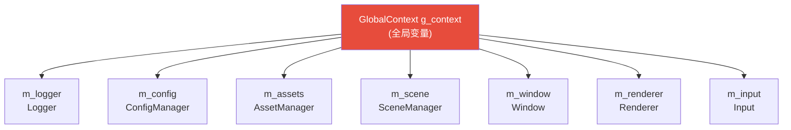
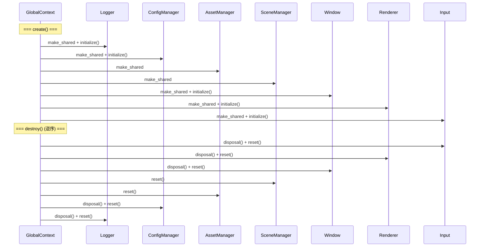
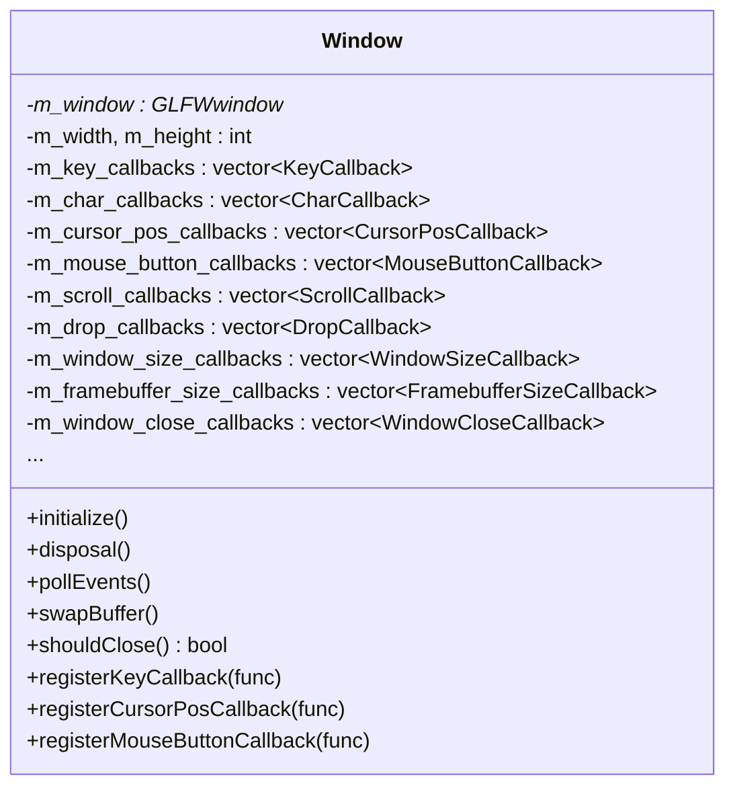
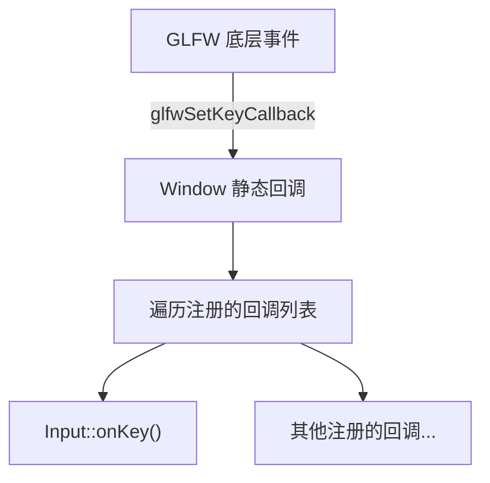
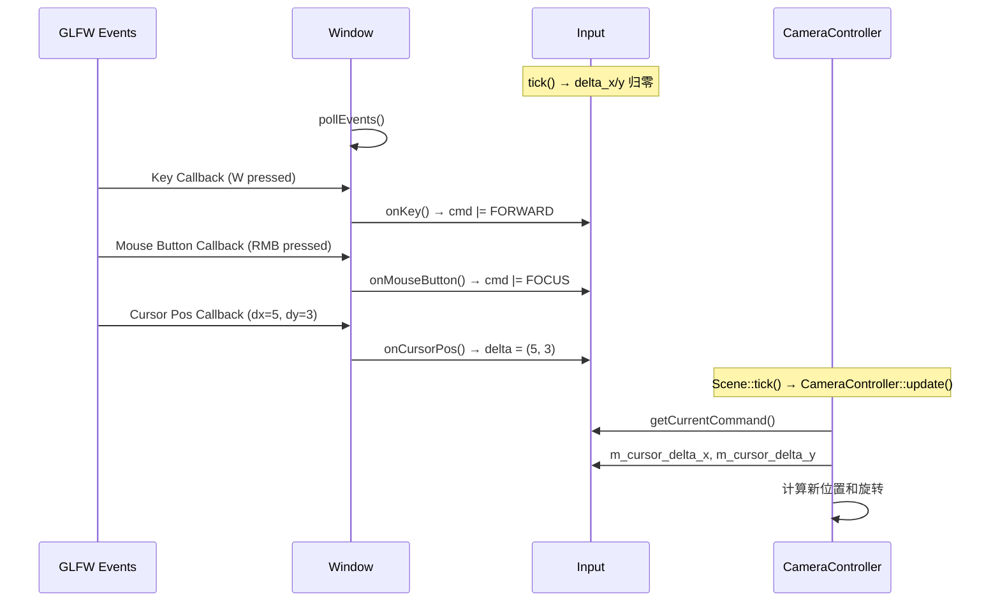

# 核心基础设施详细设计文档 (Core Infrastructure)

> **模块路径**: `src/` 根目录  
> **核心文件**: `engine.h/cpp`、`global_context.h/cpp`、`window.h/cpp`、`input.h/cpp`、`logger.h/cpp`、`utils.h`、`math.h`、`plateform/`  
> **面试关键词**: Service Locator、Game Loop、GLFW、Callback Pattern、Singleton

---

## 目录

1. [模块概述](#1-模块概述)
2. [GlobalContext — 全局上下文](#2-globalcontext--全局上下文)
3. [Engine — 引擎核心](#3-engine--引擎核心)
4. [Window — 窗口管理](#4-window--窗口管理)
5. [Input — 输入系统](#5-input--输入系统)
6. [Logger — 日志系统](#6-logger--日志系统)
7. [工具模块](#7-工具模块)
8. [设计亮点与面试要点](#8-设计亮点与面试要点)

---

## 1. 模块概述

核心基础设施是 RealmEngine 的「骨架」，提供了所有其他模块依赖的基础能力：全局状态管理、游戏主循环、窗口创建、输入处理、日志记录、平台适配和通用工具函数。

### 文件清单

| 文件 | 行数 | 职责 |
|------|------|------|
| `global_context.h/cpp` | ~100 | 全局上下文：子系统容器 + 生命周期管理 |
| `engine.h/cpp` | ~110 | 引擎核心：boot/tick/terminate 生命周期 |
| `window.h/cpp` | ~355 | 窗口管理：GLFW 窗口 + 事件回调注册 |
| `input.h/cpp` | ~195 | 输入系统：键盘/鼠标命令映射 |
| `logger.h/cpp` | ~100 | 日志系统：spdlog 异步日志封装 |
| `utils.h` | ~190 | 工具函数：XOR 加密、Base64、FNV 哈希、日志宏 |
| `math.h` | ~20 | 数学工具：AABB 结构体 |
| `plateform/plateform.h/cpp` | ~55 | 平台适配：获取可执行文件路径 |

---

## 2. GlobalContext — 全局上下文

### 2.1 设计模式

GlobalContext 采用 **Service Locator（服务定位器）** 模式，是所有子系统的中央注册表。



### 2.2 接口定义

```cpp
class GlobalContext {
public:
    void create();   // 按序创建所有子系统
    void destroy();  // 按逆序销毁所有子系统
    
    // 公开成员：子系统共享指针
    shared_ptr<Logger>        m_logger;
    shared_ptr<ConfigManager> m_config;
    shared_ptr<AssetManager>  m_assets;
    shared_ptr<SceneManager>  m_scene;
    shared_ptr<Window>        m_window;
    shared_ptr<Renderer>      m_renderer;
    shared_ptr<Input>         m_input;
};

extern GlobalContext g_context;  // 全局实例
```

### 2.3 生命周期管理



**创建顺序的依赖逻辑**：
1. **Logger** 先创建 → 其他模块初始化时可以输出日志
2. **ConfigManager** 第二 → 后续模块需要读取配置
3. **SceneManager / AssetManager** → 无特殊初始化依赖
4. **Window** → 需要 ConfigManager 提供窗口参数
5. **Renderer** → 需要 Window（OpenGL Context + 窗口尺寸）
6. **Input** → 需要 Window（注册 GLFW 回调）

**销毁顺序**：严格逆序，确保依赖者先于被依赖者销毁。

### 2.4 为什么不用 Singleton？

`GlobalContext` 使用 `extern` 全局变量而非传统 Singleton 模式。优势：
- 没有延迟初始化带来的线程安全问题
- 创建/销毁时机完全可控（显式调用 `create()`/`destroy()`）
- 不需要 `getInstance()` 函数调用开销
- 子系统的初始化顺序明确

---

## 3. Engine — 引擎核心

### 3.1 Game Loop 设计

```mermaid
stateDiagram-v2
    [*] --> Boot: Engine::boot()
    Boot --> Running: 初始化完成
    
    state Running {
        [*] --> Tick
        Tick --> LogicalTick: logicalTick()
        LogicalTick --> RenderTick: renderTick()
        RenderTick --> DeltaTime: 计算 deltaTime
        DeltaTime --> Tick: 下一帧
    }
    
    Running --> Terminate: window.shouldClose()
    Terminate --> [*]: Engine::terminate()
```

### 3.2 帧时间管理

```cpp
void Engine::tick() {
    double current_time = glfwGetTime();
    m_delta_time = current_time - m_last_frame_time;
    m_last_frame_time = current_time;
    
    // 防止大跳帧（如窗口拖动、断点调试后）
    if (m_delta_time > m_max_delta_time)
        m_delta_time = m_max_delta_time;
    
    logicalTick();
    renderTick();
}
```

**deltaTime 钳制**：`m_max_delta_time`（默认 0.1s = 100ms）防止帧间隔过大导致物理/动画跳跃。

### 3.3 Tick 分层

```cpp
void Engine::logicalTick() const {
    g_context.m_input->tick();                              // 1. 输入采集
    g_context.m_window->pollEvents();                       // 2. 事件轮询
    g_context.m_scene->getCurrentOrNewScene()->tick(dt);    // 3. 场景逻辑
}

void Engine::renderTick() const {
    g_context.m_renderer->getRenderScene()->syncFromCurrentScene();  // 4. 数据同步
    g_context.m_renderer->render();                                  // 5. 渲染
}
```

**执行顺序的设计意图**：
1. **Input 先于 pollEvents**：先重置输入状态（如鼠标 delta 归零），再处理本帧新事件
2. **Scene tick 先于 Render**：确保相机位姿更新后再渲染
3. **Sync 先于 Render**：确保渲染场景反映最新的逻辑状态

### 3.4 两种运行模式

| 模式 | 启动方式 | 差异 |
|------|---------|------|
| **Editor 模式** | `RealmEngine`（默认） | Editor 包装 Engine，叠加 ImGui UI |
| **Debug 模式** | `RealmEngine debug` | Engine 直接运行，无 UI，自动加载/保存场景 |

---

## 4. Window — 窗口管理

### 4.1 职责

Window 封装了 GLFW 的窗口创建和事件系统，提供了类型安全的 C++ 回调注册接口。

### 4.2 回调系统设计



**回调机制**：



```cpp
// 回调注册示例
void Input::initialize() {
    g_context.m_window->registerKeyCallback(
        [this](GLFWwindow* w, int key, int scancode, int action, int mods) {
            this->onKey(w, key, scancode, action, mods);
        });
    
    g_context.m_window->registerCursorPosCallback(
        [this](GLFWwindow* w, double x, double y) {
            this->onCursorPos(w, x, y);
        });
    
    g_context.m_window->registerMouseButtonCallback(
        [this](GLFWwindow* w, int button, int action, int mods) {
            this->onMouseButton(w, button, action, mods);
        });
}
```

### 4.3 初始化流程

```
Window::initialize()
├── glfwInit()
├── glfwWindowHint(CONTEXT_VERSION, 3.3)
├── glfwWindowHint(OPENGL_PROFILE, CORE_PROFILE)
├── glfwCreateWindow(width, height, title)
├── glfwMakeContextCurrent(window)
├── gladLoadGL(glfwGetProcAddress)    ← 加载 OpenGL 函数
├── glfwSwapInterval(vsync ? 1 : 0)
├── 设置所有 GLFW 回调（Key/Char/Cursor/Mouse/Scroll/Drop/Size/Close）
└── 保存 this 到 glfwSetWindowUserPointer
```

**GLFW 回调 → C++ 对象**：通过 `glfwSetWindowUserPointer(window, this)` + `glfwGetWindowUserPointer(window)` 在 C 回调中获取 `Window*`，再调用成员函数。

---

## 5. Input — 输入系统

### 5.1 命令系统

Input 模块将底层按键映射为抽象的**命令 (Command)**：

```cpp
using Command = unsigned int;

enum class BindableCommand : unsigned int {
    FORWARD  = 1 << 0,    // W
    BACKWARD = 1 << 1,    // S
    LEFT     = 1 << 2,    // A
    RIGHT    = 1 << 3,    // D
    SPRINT   = 1 << 4,    // Left Shift
    FOCUS    = 1 << 5,    // 右键按下
};
```

使用 **位掩码 (Bitmask)** 设计，支持多命令同时激活：

```cpp
Command cmd = input->getCurrentCommand();

// 检查组合键
if ((cmd & FORWARD) && (cmd & SPRINT)) {
    // 冲刺前进
}
```

### 5.2 按键映射

| GLFW 按键 | 命令 | 行为 |
|-----------|------|------|
| `W` | FORWARD | 相机前进 |
| `S` | BACKWARD | 相机后退 |
| `A` | LEFT | 相机左移 |
| `D` | RIGHT | 相机右移 |
| `Left Shift` | SPRINT | 加速移动 |
| `右键按住` | FOCUS | 启用鼠标旋转 |

### 5.3 鼠标系统

```cpp
class Input {
    double m_cursor_delta_x = 0;  // 本帧鼠标 X 偏移
    double m_cursor_delta_y = 0;  // 本帧鼠标 Y 偏移
    
    void tick() {
        m_cursor_delta_x = 0;  // 每帧重置
        m_cursor_delta_y = 0;
    }
    
    void onCursorPos(GLFWwindow*, double x, double y) {
        if (isFocused()) {  // 仅在 FOCUS 模式下计算 delta
            m_cursor_delta_x = x - m_last_cursor_x;
            m_cursor_delta_y = y - m_last_cursor_y;
        }
        m_last_cursor_x = x;
        m_last_cursor_y = y;
    }
};
```

**FOCUS 模式**：只有按住右键时才计算鼠标 delta，避免非操作时相机旋转。

### 5.4 输入处理时序



---

## 6. Logger — 日志系统

### 6.1 基于 spdlog 的异步日志

```cpp
class Logger {
    std::shared_ptr<spdlog::async_logger> m_logger;
    
    void initialize() {
        spdlog::init_thread_pool(8192, 1);  // 异步队列
        auto console_sink = make_shared<spdlog::sinks::stdout_color_sink_mt>();
        m_logger = make_shared<spdlog::async_logger>(
            "RealmEngine", console_sink, spdlog::thread_pool());
        spdlog::register_logger(m_logger);
    }
    
    template<typename... Args>
    void log(LogLevel level, const std::string& fmt, Args&&... args);
};
```

### 6.2 日志级别

```cpp
enum class LogLevel { Debug, Info, Warn, Error, Fatal };
```

### 6.3 便捷宏（utils.h）

```cpp
#define info(msg)  g_context.m_logger->log(LogLevel::Info, msg)
#define debug(msg) g_context.m_logger->log(LogLevel::Debug, msg)
#define warn(msg)  g_context.m_logger->log(LogLevel::Warn, msg)
#define err(msg)   g_context.m_logger->log(LogLevel::Error, msg)
#define fatal(msg) g_context.m_logger->log(LogLevel::Fatal, msg)
```

---

## 7. 工具模块

### 7.1 utils.h

| 工具函数 | 用途 |
|---------|------|
| `xor_encrypt(input, key)` | XOR 对称加密/解密 |
| `base64_encode(input)` | Base64 编码 |
| `base64_decode(input)` | Base64 解码 |
| `fnv1a_32(str)` / `fnv1a_64(str)` | FNV-1a 哈希（32/64 位） |
| `info/debug/warn/err/fatal` | 日志便捷宏 |

### 7.2 math.h

```cpp
struct AABB {
    glm::vec3 min, max;
    glm::vec3 center() const { return (min + max) * 0.5f; }
    glm::vec3 extent() const { return (max - min) * 0.5f; }
};
```

### 7.3 Plateform

```cpp
class Plateform {
    static std::filesystem::path getExecutablePath();
    // Linux:   /proc/self/exe
    // Windows: GetModuleFileName
    // macOS:   _NSGetExecutablePath
};
```

---

## 8. 设计亮点与面试要点

### 面试高频问题

**Q: 为什么使用 Service Locator 而不是依赖注入？**

A: Service Locator 更适合游戏引擎场景：
- 子系统数量固定且已知（7 个）
- 访问模式：任意模块可能需要任意子系统
- 避免了构造函数参数爆炸（每个类都需要传入多个依赖）
- `g_context.m_renderer` 比 DI 容器的 `resolve<Renderer>()` 更直观

缺点是增加了全局状态的耦合，但对于单实例引擎来说是合理的权衡。

**Q: Game Loop 为什么要分离 logicalTick 和 renderTick？**

A: 分离逻辑和渲染有几个好处：
1. **未来可独立帧率**：逻辑可以固定 60fps，渲染不限帧
2. **代码清晰**：逻辑更新（输入、AI、物理）和渲染更新（同步、绘制）职责分明
3. **测试友好**：可以单独测试逻辑而不需要图形上下文

**Q: Input 的命令系统为什么用位掩码？**

A: 位掩码的优势：
1. **组合检测**：一次 AND 操作检测多个同时按下的键
2. **零分配**：所有状态存在一个 `unsigned int` 中，无堆分配
3. **高效清除**：`cmd &= ~FORWARD` 清除单个命令
4. **可序列化**：整个输入状态就是一个整数

**Q: Window 的回调为什么用 vector 而不是单个 function？**

A: 多回调注册支持多个系统同时监听同一事件。例如：
- Input 监听键盘事件映射为命令
- Editor 可能监听键盘事件处理快捷键
- 调试系统可能监听键盘事件切换 wireframe

如果只允许单个回调，后注册的会覆盖先注册的。

---

> **模块总结**：核心基础设施通过 GlobalContext (Service Locator)、Engine (Game Loop)、Window (GLFW 封装)、Input (命令映射)、Logger (异步日志) 构建了引擎的运行骨架。各模块职责单一，初始化/销毁顺序明确，为上层模块提供了稳定的基础设施。
