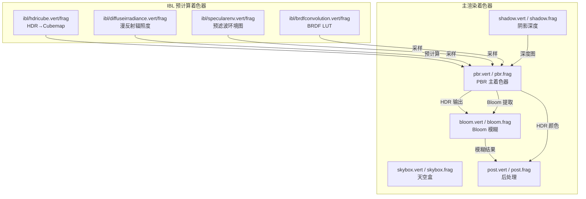
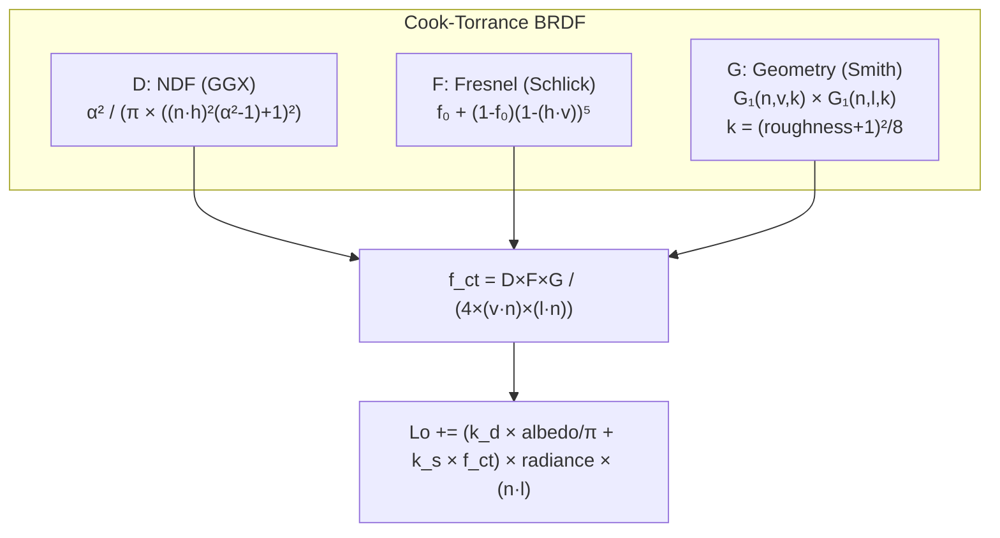

# 着色器与 IBL 管线详细设计文档 (Shader & IBL Pipeline)

> **模块路径**: `shaders/`、`src/render/ibl/`  
> **着色器文件数**: 18 个（8 主着色器 + 10 IBL 着色器）  
> **面试关键词**: Cook-Torrance BRDF、PBR、IBL、Split-Sum Approximation、Importance Sampling、Shadow Mapping

---

## 目录

1. [着色器总览](#1-着色器总览)
2. [PBR 主着色器详解](#2-pbr-主着色器详解)
3. [IBL 预计算着色器](#3-ibl-预计算着色器)
4. [阴影着色器](#4-阴影着色器)
5. [Bloom 着色器](#5-bloom-着色器)
6. [后处理着色器](#6-后处理着色器)
7. [天空盒着色器](#7-天空盒着色器)
8. [数学推导与理论基础](#8-数学推导与理论基础)
9. [面试要点总结](#9-面试要点总结)

---

## 1. 着色器总览



### 着色器文件清单

| 着色器 | Vertex | Fragment | 用途 |
|--------|--------|----------|------|
| PBR | `pbr.vert` | `pbr.frag` | Cook-Torrance BRDF + IBL + Shadow |
| Skybox | `skybox.vert` | `skybox.frag` | HDR Cubemap 天空盒 |
| Shadow | `shadow.vert` | `shadow.frag` | 深度写入（空 Fragment） |
| Bloom | `bloom.vert` | `bloom.frag` | 9×9 高斯模糊 |
| Post | `post.vert` | `post.frag` | Tonemapping + Gamma + Bloom 合成 |
| HDRI Cube | `ibl/hdricube.vert` | `ibl/hdricube.frag` | 等距柱状→Cubemap |
| Diffuse Irradiance | `ibl/diffuseirradiance.vert` | `ibl/diffuseirradiance.frag` | 漫反射辐照度卷积 |
| Specular Env | `ibl/specularenv.vert` | `ibl/specularenv.frag` | GGX 重要性采样预滤波 |
| BRDF Conv | `ibl/brdfconvolution.vert` | `ibl/brdfconvolution.frag` | BRDF 积分 LUT |

---

## 2. PBR 主着色器详解

### 2.1 Vertex Shader (pbr.vert)

**输入属性**：

| Location | 属性 | 用途 |
|----------|------|------|
| 0 | `aPos` (vec3) | 顶点位置 |
| 1 | `aNormal` (vec3) | 顶点法线 |
| 2 | `aTextureCoordinates` (vec2) | UV 坐标 |
| 3 | `aTangent` (vec3) | 切线向量 |
| 4 | `aBitangent` (vec3) | 副切线向量 |

**输出**：

| Varying | 用途 |
|---------|------|
| `textureCoordinates` | UV 传递给片段着色器 |
| `worldCoordinates` | 世界空间片段位置 |
| `tangent/bitangent/normal` | 世界空间 TBN 向量（经法线矩阵变换） |
| `fragPosLightSpace` | 光源空间片段位置（用于 Shadow Map） |

**法线矩阵**：`mat3 normalMatrix = transpose(inverse(mat3(model)))` — 确保非均匀缩放下法线方向正确。

### 2.2 Fragment Shader (pbr.frag)

#### 2.2.1 数据结构

```glsl
struct Material {
    bool use_texture_*;          // 5 个纹理开关
    vec3 albedo; float metallic; float roughness; float ao; vec3 emissive;
    sampler2D texture_*;         // 5 个纹理采样器
};

struct LightData {               // std140 布局，与 C++ LightData 对应
    vec4 position;               // xyz=位置, w=类型
    vec4 direction;              // xyz=方向, w=强度
    vec4 color;                  // rgb=颜色, w=常数衰减
    vec4 attenuation;            // x=线性, y=二次, z=范围, w=内锥角
    vec4 spot_area;              // x=外锥角, y=宽, z=高, w=padding
};
```

#### 2.2.2 Cook-Torrance BRDF 实现

PBR 着色器实现了完整的 Cook-Torrance 微面元 BRDF：

```
f_r = k_d × f_lambert + k_s × f_cook-torrance

其中：
  f_lambert = albedo / π
  f_cook-torrance = D × F × G / (4 × (ω_o · n)(ω_i · n))
```

**三个核心函数**：

| 函数 | 缩写 | 实现 | 作用 |
|------|------|------|------|
| 法线分布函数 | D | GGX (Trowbridge-Reitz) | 微面元朝向分布 |
| 菲涅尔方程 | F | Schlick 近似 | 反射率随角度变化 |
| 几何函数 | G | Smith + Schlick-GGX | 微面元自遮挡 |



#### 2.2.3 四种光源处理

```glsl
for (int i = 0; i < lightCount; i++) {
    int lightType = int(lights[i].position.w);
    
    if (lightType == 0) {       // Point
        // 距离衰减 + 范围裁剪
        float attenuation = 1.0 / (c + l*d + q*d²);
    }
    else if (lightType == 1) {  // Directional
        // 无衰减，固定方向
        // Shadow Map 采样
    }
    else if (lightType == 2) {  // Spot
        // 距离衰减 + 内外锥角 smoothstep
        float spotFactor = clamp((theta - outerCos) / (innerCos - outerCos), 0, 1);
    }
    else if (lightType == 3) {  // Area
        // 距离²衰减 + 朝向因子
    }
    
    Lo += discreteMonteCarloContribution(l, radiance, n, v, albedo, metallic, roughness, f0);
}
```

#### 2.2.4 IBL 间接光照

```glsl
// 漫反射间接光
vec3 irradiance = texture(diffuseIrradianceMap, n).rgb;
vec3 diffuse = irradiance * albedo;

// 镜面反射间接光（Split-Sum）
vec3 prefiltered = textureLod(prefilteredEnvMap, r, roughness * 4.0).rgb;
vec2 brdf = texture(brdfConvolutionMap, vec2(NdotV, roughness)).rg;
vec3 specular = prefiltered * (kSpecular * brdf.x + brdf.y);

// 合成
vec3 ambient = (kDiffuse * diffuse + specular) * ao;
```

#### 2.2.5 Shadow Map 采样（PCF + Poisson Disk）

```glsl
// 16 个预计算的 Poisson Disk 采样点
const vec2 poissonDisk[16] = vec2[](...);

float calculateShadow(vec4 fragPosLightSpace, vec3 n, vec3 l) {
    vec3 projCoords = fragPosLightSpace.xyz / fragPosLightSpace.w;
    projCoords = projCoords * 0.5 + 0.5;  // [-1,1] → [0,1]
    
    float bias = max(0.05 * (1.0 - dot(n, l)), 0.005);  // 自适应偏移
    float shadow = 0.0;
    
    // 每像素随机旋转角度（伪随机）
    float randomAngle = fract(dot(projCoords.xy, vec2(12.9898, 78.233)) * 43758.5453) * 2π;
    
    for (int i = 0; i < 16; i++) {
        vec2 offset = rotate2D(poissonDisk[i], randomAngle) * texelSize;
        float pcfDepth = texture(shadowMap, projCoords.xy + offset).r;
        shadow += currentDepth - bias > pcfDepth ? 1.0 : 0.0;
    }
    return 1.0 - shadow / 16.0;
}
```

#### 2.2.6 双输出（MRT）

```glsl
layout(location = 0) out vec4 FragColor;   // HDR 颜色
layout(location = 1) out vec4 BloomColor;  // Bloom 亮度提取

// Bloom 提取逻辑
float brightness = dot(FragColor.rgb, vec3(0.2126, 0.7152, 0.0722));  // ITU-R BT.709 亮度权重
BloomColor = brightness > bloomBrightnessCutoff ? vec4(emissive, 1.0) : vec4(0, 0, 0, 1);
```

---

## 3. IBL 预计算着色器

### 3.1 HDR → Cubemap (hdricube.frag)

```glsl
// 等距柱状投影 → 球面坐标 → UV
vec2 sphericalToCartesian(vec3 v) {
    vec2 xy = vec2(atan(v.z, v.x), asin(v.y));
    xy *= vec2(0.1591, 0.3183);  // 1/(2π), 1/π
    xy += 0.5;
    return xy;
}
```

对 Cubemap 的 6 个面，分别从 3D 方向映射到 2D HDR 纹理坐标进行采样。

### 3.2 漫反射辐照度 (diffuseirradiance.frag)

**数学原理**：

\[
E(\mathbf{n}) = \int_{\Omega} L_i(\omega_i) \cdot (\mathbf{n} \cdot \omega_i) \, d\omega_i
\]

**离散近似**：

```glsl
for (float phi = 0; phi < 2*PI; phi += 0.025) {
    for (float theta = 0; theta < PI/2; theta += 0.025) {
        vec3 sampleDir = sphericalToTangent(phi, theta);
        sampleDir = tangentToWorld(sampleDir, tangent, bitangent, normal);
        
        irradiance += texture(envCubemap, sampleDir).rgb 
                      * sin(theta)   // 球面面积补偿
                      * cos(theta);  // 兰伯特余弦
        numSamples++;
    }
}
irradiance = PI * irradiance / numSamples;
```

**输出**：32×32 的低分辨率 Cubemap，存储每个方向的漫反射辐照度。

### 3.3 预滤波环境贴图 (specularenv.frag)

**数学原理**（Split-Sum 近似第一部分）：

\[
L_{prefiltered}(\mathbf{r}, \alpha) = \frac{\sum_{k=1}^{N} L_i(\omega_k) \cdot (\mathbf{n} \cdot \omega_k)}{\sum_{k=1}^{N} (\mathbf{n} \cdot \omega_k)}
\]

**GGX 重要性采样**：

```glsl
// Hammersley 准随机序列
vec2 hammersley(uint i, uint N) {
    return vec2(float(i) / float(N), radicalInverseVanDerCorput(i));
}

// GGX 重要性采样：生成偏向法线的半球采样方向
vec3 importanceSampleGGX(vec2 Xi, vec3 N, float roughness) {
    float alpha = roughness * roughness;
    float phi = 2.0 * PI * Xi.x;
    float cosTheta = sqrt((1 - Xi.y) / (1 + (alpha*alpha - 1) * Xi.y));
    // ... 球面→笛卡尔 → 切线空间→世界空间
}
```

**自适应 Mip Level**：根据 GGX PDF 概率密度自动选择采样的 Mip Level，低概率样本使用更高 Mip Level（更模糊），减少走样。

**参数**：1024 个样本/像素，5 个 Mip Level，每级粗糙度递增。

### 3.4 BRDF 积分 LUT (brdfconvolution.frag)

**数学原理**（Split-Sum 近似第二部分）：

\[
\int_{\Omega} f_r(\omega_i, \omega_o) \cdot (\mathbf{n} \cdot \omega_i) \, d\omega_i \approx F_0 \cdot \text{Scale} + \text{Bias}
\]

```glsl
// 输入：textureCoordinates = (NdotV, roughness)
// 输出：vec2(F0Scale, F0Bias)

for (uint i = 0; i < 1024; i++) {
    vec3 H = importanceSampleGGX(hammersley(i, 1024), N, roughness);
    vec3 L = reflect(-V, H);
    
    float G = geometrySmith(N, V, L, roughness);  // IBL 版本 k = α²/2
    float GVis = (G * VdotH) / (NdotH * NdotV);
    float Fc = pow(1.0 - VdotH, 5.0);
    
    F0Scale += GVis * (1.0 - Fc);  // 与 F0 相乘的部分
    F0Bias  += GVis * Fc;           // 与 F0 无关的部分
}
```

**IBL 与直接光照的 k 值差异**：

| 场景 | k 值 |
|------|------|
| 直接光照 | `k = (roughness + 1)² / 8` |
| IBL | `k = roughness² / 2` |

---

## 4. 阴影着色器

### shadow.vert
```glsl
gl_Position = lightSpaceMatrix * model * vec4(aPos, 1.0);
```

### shadow.frag
```glsl
void main() {}  // 空着色器 — 仅需要深度写入
```

极简设计：只需要光源视角的深度值，Fragment Shader 为空，由硬件自动写入深度缓冲。

---

## 5. Bloom 着色器

### bloom.frag — 9×9 高斯模糊

```glsl
const float weights[5] = float[](0.227027, 0.1945946, 0.1216216, 0.054054, 0.016216);

// 中心像素
result += textureLod(texture, uv, mipLevel).rgb * weights[0];

// 对称采样
for (int i = 1; i < 5; i++) {
    vec2 offset = texelSize * i * blurDirection;
    result += texture(texture, uv + offset).rgb * weights[i];
    result += texture(texture, uv - offset).rgb * weights[i];
}
```

**设计要点**：
- 可分离模糊：先水平后垂直（或反向），将 O(n²) 降为 O(2n)
- `blurDirection` Uniform 控制模糊方向
- `sampleMipLevel` 支持在不同 Mip Level 上模糊

---

## 6. 后处理着色器

### post.frag

```glsl
vec3 color = texture(colorTexture, uv).rgb;

// Bloom 合成：累加 6 个 Mip Level
if (bloomEnabled) {
    vec3 bloom = vec3(0);
    for (int i = 0; i <= 5; i++)
        bloom += textureLod(bloomTexture, uv, i).rgb;
    color += bloom * bloomIntensity;
}

// Reinhard Tonemapping
if (tonemappingEnabled)
    color = color / (color + vec3(1.0));

// Gamma Correction
color = pow(color, vec3(1.0 / gammaCorrectionFactor));
```

---

## 7. 天空盒着色器

### skybox.vert — 深度技巧

```glsl
vec4 position = projection * view * model * vec4(aPos, 1.0);
gl_Position = vec4(position.xy, position.w, position.w);  // z = w → 透视除法后 z = 1.0
```

设置 `z = w` 使得天空盒始终在最远处（深度 = 1.0），不遮挡任何物体。

### skybox.frag — 双输出

```glsl
FragColor = texture(skybox, textureCoordinates);

// 天空盒也参与 Bloom
float brightness = dot(FragColor.rgb, vec3(0.2126, 0.7152, 0.0722));
BloomColor = brightness > cutoff ? FragColor : vec4(0, 0, 0, 1);
```

---

## 8. 数学推导与理论基础

### 8.1 渲染方程

\[
L_o(\mathbf{p}, \omega_o) = L_e + \int_{\Omega} f_r(\omega_i, \omega_o) \cdot L_i(\mathbf{p}, \omega_i) \cdot (\mathbf{n} \cdot \omega_i) \, d\omega_i
\]

- \(L_o\)：出射辐射度
- \(L_e\)：自发光
- \(f_r\)：BRDF
- \(L_i\)：入射辐射度
- \(\mathbf{n} \cdot \omega_i\)：兰伯特余弦项

### 8.2 Cook-Torrance 微面元模型

\[
f_r = \frac{k_d \cdot \text{albedo}}{\pi} + \frac{D(\mathbf{h}) \cdot F(\omega_o, \mathbf{h}) \cdot G(\omega_i, \omega_o, \mathbf{h})}{4 \cdot (\omega_o \cdot \mathbf{n}) \cdot (\omega_i \cdot \mathbf{n})}
\]

### 8.3 GGX (Trowbridge-Reitz) NDF

\[
D(\mathbf{h}) = \frac{\alpha^2}{\pi \cdot ((\mathbf{n} \cdot \mathbf{h})^2 \cdot (\alpha^2 - 1) + 1)^2}
\]

其中 \(\alpha = \text{roughness}^2\)（Disney/Epic 推荐的粗糙度重映射）。

### 8.4 Fresnel-Schlick 近似

\[
F(\omega_o, \mathbf{h}) = F_0 + (1 - F_0) \cdot (1 - (\mathbf{h} \cdot \omega_o))^5
\]

- 电介质：\(F_0 = 0.04\)
- 金属：\(F_0 = \text{albedo}\)
- 混合：`F0 = mix(vec3(0.04), albedo, metallic)`

### 8.5 Smith-Schlick-GGX 几何函数

\[
G(\omega_i, \omega_o) = G_1(\omega_o) \cdot G_1(\omega_i)
\]

\[
G_1(\mathbf{v}) = \frac{\mathbf{n} \cdot \mathbf{v}}{(\mathbf{n} \cdot \mathbf{v})(1-k) + k}
\]

### 8.6 Split-Sum 近似

IBL 镜面反射项的积分被拆分为：

\[
\int_\Omega L_i \cdot f_r \cdot \cos\theta \, d\omega \approx \underbrace{\left(\frac{\sum L_i \cdot \cos\theta}{\sum \cos\theta}\right)}_{\text{Prefiltered Env Map}} \times \underbrace{\left(F_0 \cdot \text{Scale} + \text{Bias}\right)}_{\text{BRDF LUT}}
\]

---

## 9. 面试要点总结

### 核心概念速查

| 概念 | 一句话解释 |
|------|-----------|
| **PBR** | 基于物理的渲染，使用真实世界光学原理计算光照 |
| **Cook-Torrance** | 微面元 BRDF 模型，描述粗糙表面的镜面反射 |
| **GGX** | 法线分布函数，描述微面元朝向概率 |
| **Fresnel** | 反射率随入射角增大而增大的物理现象 |
| **IBL** | 使用环境贴图作为光源的间接光照技术 |
| **Split-Sum** | 将 IBL 积分拆为预滤波贴图和 BRDF LUT 的近似 |
| **Importance Sampling** | 沿高概率方向集中采样，提高蒙特卡洛积分效率 |
| **Hammersley** | 低差异准随机序列，采样分布比伪随机更均匀 |
| **PCF** | 多次采样 Shadow Map 取平均，产生软阴影 |
| **Poisson Disk** | 预计算的不规则采样分布，消除规则采样条纹 |
| **Tonemapping** | 将 HDR 值压缩到 [0,1] 的可显示范围 |
| **Gamma Correction** | 补偿显示器非线性响应，pow(color, 1/2.2) |

### 面试高频问题

**Q: PBR 中金属和非金属的区别是什么？**

A: 
- **非金属（电介质）**：F0 = 0.04，有明显的漫反射，镜面反射颜色为白色
- **金属**：F0 = albedo 颜色，几乎无漫反射（kDiffuse × (1-metallic)），镜面反射颜色为材质本身颜色
- `metallic` 参数通过 `mix(vec3(0.04), albedo, metallic)` 混合 F0

**Q: 为什么 roughness 要平方？**

A: Disney 和 Epic Games 的研究发现，美术家对线性 roughness 值的感知更直观，但物理模型中 α = roughness² 能产生更正确的视觉效果。这是一个感知线性化的映射。

**Q: IBL 的 Split-Sum 近似精度如何？**

A: 在大多数情况下误差很小（< 5%），因为：
1. 环境贴图通常较为平滑
2. BRDF 的主要变化集中在 NdotV 和 roughness 两个维度
3. 预滤波贴图通过 GGX 重要性采样精确捕获了高光形状

误差主要出现在极低粗糙度（接近镜面）和极端视角下。

---

> **模块总结**：着色器模块实现了完整的 PBR 渲染管线，从 Cook-Torrance BRDF 到 IBL 预计算再到后处理，涵盖了现代实时渲染的核心技术。每个着色器都有清晰的数学理论支撑，是面试中展示图形学深度的最佳素材。
